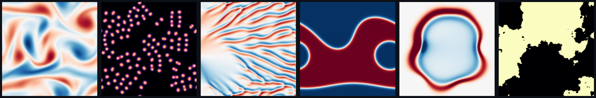
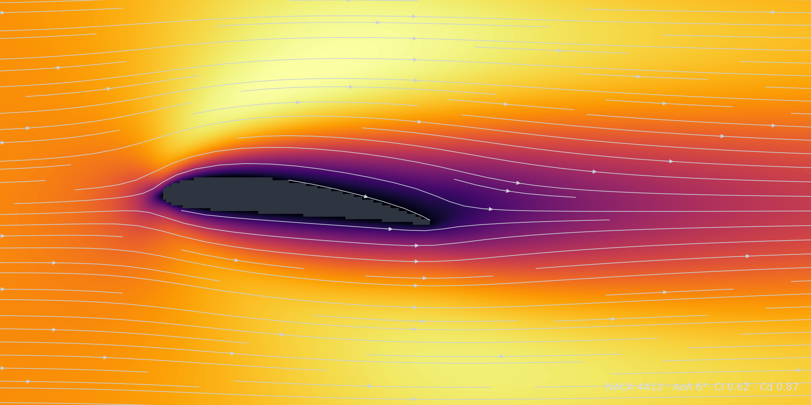
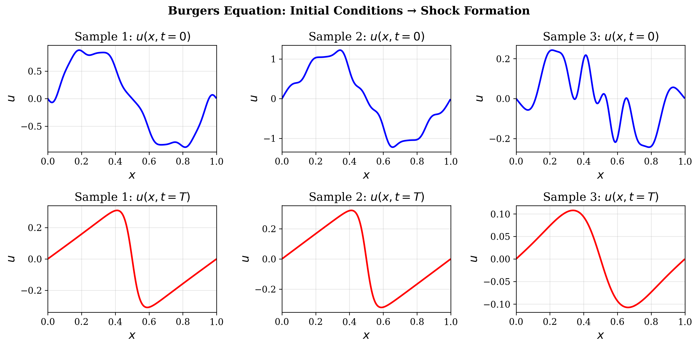
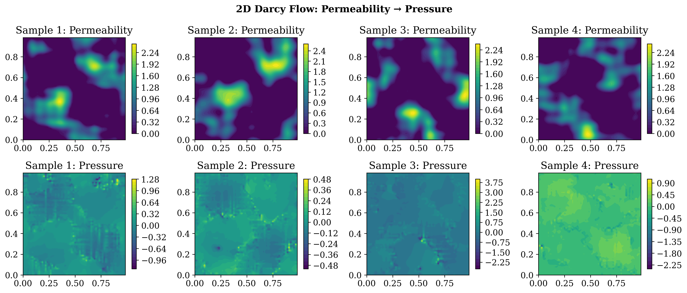
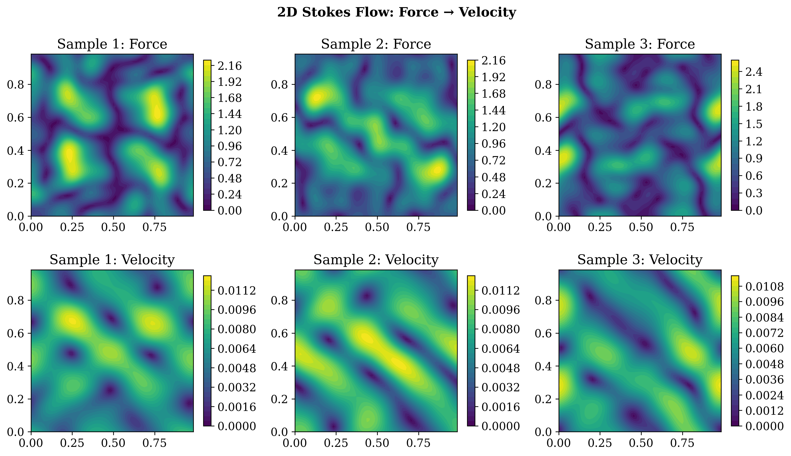
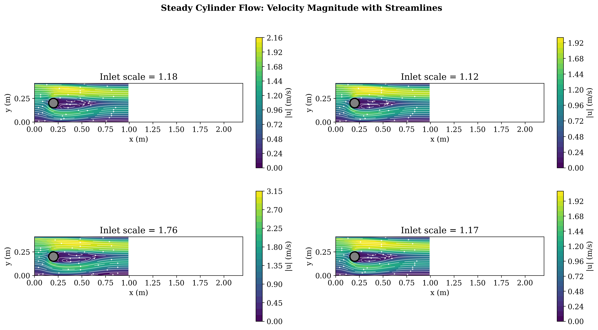
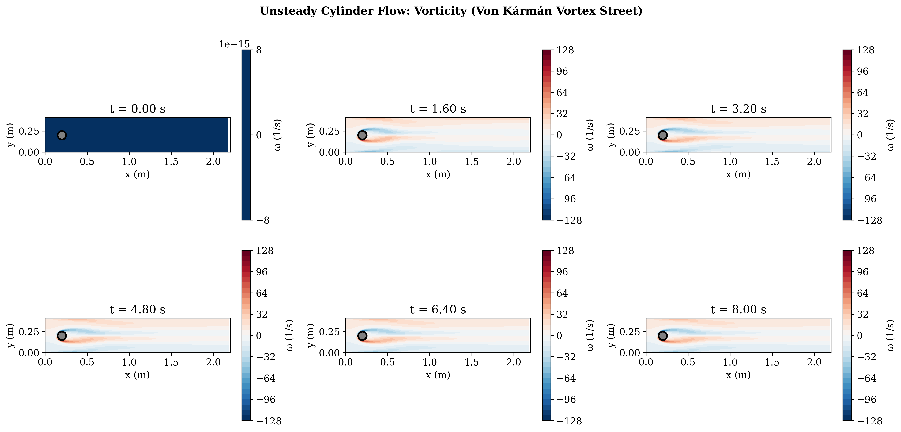
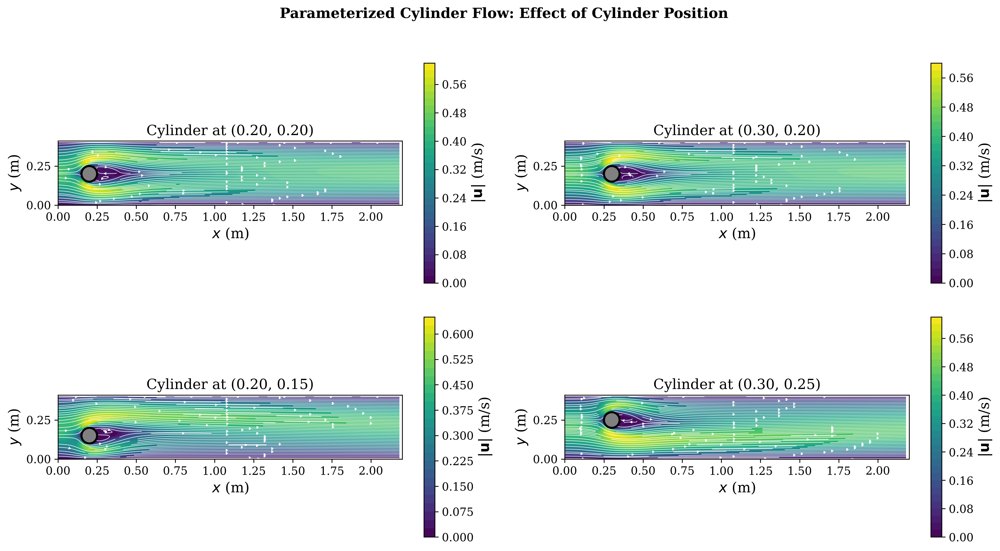

# PDEForge

**Author: Peter Yatsyshin**

**Documentation: [pyatsysh.github.io/PDEForge](https://pyatsysh.github.io/PDEForge/)**

**A unified framework for generating PDE datasets for operator learning and uncertainty quantification.**



PDEForge provides a simple, unified interface to generate training data for functional learning tasks from various PDE models. It is designed with **uncertainty quantification (UQ)** as a first-class concern.

## FEM Training Data Without Installing FEniCS

PDEForge ships **finite-element training-data generators** (steady and
vortex-shedding cylinder flows, Smagorinsky LES turbulence, and a
**parameterised NACA airfoil family** with per-sample lift and drag), and you
**never install FEniCSx**. The FEM stack (PETSc, MPI, gmsh, dolfinx) is
famously painful to build; here it lives inside a container, solved once in
CI, and you drive it from one command:

```bash
docker run -v $PWD/data:/data ghcr.io/pyatsysh/pdeforge:fenicsx \
    pdeforge generate --model naca_flow_2d --n 200 \
    --resolution x=96 y=48 --seed 0 --out /data/naca
```

Every sample draws its own airfoil (thickness, camber, angle of attack), the
channel is re-meshed, the flow is solved, and the dataset (SDF geometry
channel, velocity/pressure fields, lift/drag coefficients, full provenance
metadata) lands in `./data/naca`. No compiler, no conda, no PETSc build.
The same command works for every one of the 40 models, and
`pdeforge reproduce metadata.json` regenerates any dataset bit-for-bit:
the container pins the environment, the metadata pins the run.

Pull the image on any machine with Docker and watch an airfoil dataset
appear from one line:



## Why PDEForge?

| Challenge | PDEForge Solution |
|-----------|-------------------|
| Static datasets with fixed resolution | Generate at any resolution you need |
| Different APIs for each dataset | Unified interface for all models |
| No way to explore before downloading | Interactive visualization |
| No stochastic/UQ-ready datasets | Built-in support for stochastic PDEs |
| Unclear train/val/test splits | Dedicated calibration split for UQ |
| FEM data means installing FEniCS | One docker command: never install it |

PDEForge is built to serve uncertainty quantification workflows for neural operators: every dataset can carry a dedicated calibration split for conformal prediction (see [UQ Workflow](#uq-workflow) below).

## Installation

```bash
# Basic installation
pip install pdeforge

# With notebook support (ipywidgets)
pip install pdeforge[notebook]

# With HDF5 support
pip install pdeforge[hdf5]

# All optional dependencies
pip install pdeforge[all]

# Development installation
git clone https://github.com/pyatsysh/PDEForge.git
cd pdeforge
pip install -e ".[dev]"
```

### Quick Start with Setup Scripts

We provide setup scripts to create conda environments with all dependencies:

```bash
# Basic environment (spectral models only)
./setup_env.sh

# Environment with FEniCSx support (for complex geometry models)
./setup_fenicsx_env.sh
```

These scripts create conda environments, install dependencies, register Jupyter kernels, and run tests.

### Zero-Install: the Docker Appliance

Skip installation entirely: the container ships everything (including the
FEniCSx stack in the `:fenicsx` tag) and datasets land in a mounted folder:

```bash
# spectral models (32 of 40): slim image
docker run -v $PWD/data:/data ghcr.io/pyatsysh/pdeforge \
    pdeforge generate --preset fno_darcy_2d --n 1024 \
    --resolution x=421 y=421 --seed 0 --out /data/darcy421

# FEM models too (cylinder flows, NACA airfoils): full image
docker run -v $PWD/data:/data ghcr.io/pyatsysh/pdeforge:fenicsx \
    pdeforge generate --model naca_flow_2d --n 100 \
    --resolution x=96 y=48 --seed 0 --out /data/naca
```

GPU images add JAX CUDA wheels: the spectral models accelerate on any
NVIDIA GPU (host needs the driver + nvidia-container-toolkit; FEM models
run on CPU in all images):

```bash
docker run --gpus all -v $PWD/data:/data ghcr.io/pyatsysh/pdeforge:cuda \
    pdeforge generate --model ns_vorticity_2d --backend jax --n 5000 \
    --resolution x=128 y=128 --seed 0 --out /data/ns

# both stacks in one box: JAX on the GPU, FEniCSx on the CPU
docker run --gpus all -v $PWD/data:/data ghcr.io/pyatsysh/pdeforge:fenicsx-cuda ...
```

The same CLI works in any local install: `pdeforge generate|reproduce|models|presets|describe`.
`pdeforge reproduce metadata.json --out ./again` regenerates any seeded
dataset from its own metadata: the container pins the environment, the
metadata pins the run.

### Why Two Installation Options?

PDEForge offers two installation paths because of the trade-off between simplicity and capability:

| | Basic Install | FEniCSx Install |
|---|---|---|
| **Dependencies** | NumPy, SciPy, Matplotlib | + FEniCSx, PETSc, MPI, gmsh |
| **Install time** | ~1 minute | ~1-5 minutes (with mamba) |
| **Models available** | 14 spectral models | 18 models (+ complex geometry) |
| **Use case** | Most operator learning tasks | Flow around obstacles, complex domains |

**Most PDE problems can be solved with spectral methods.** The basic installation covers:
- 1D: Burgers, Heat, Wave, Allen-Cahn, FitzHugh-Nagumo, Stochastic Heat
- 2D: Darcy flow, Stokes flow, Heat, Wave, Allen-Cahn, FitzHugh-Nagumo, Stochastic Heat
- 2D / 3D: Cahn-Hilliard (spinodal decomposition)

FEniCSx is only needed for **complex geometries** (e.g., flow around obstacles) where spectral methods don't apply. If you're unsure, start with the basic installation: you can always add FEniCSx later.

## Quick Start

```python
from pdeforge import generate_dataset, list_models

# See available models
print(list_models())
# ['burgers_1d', 'darcy_2d', 'stokes_2d']

# Generate a dataset - same API for all models!
dataset = generate_dataset(
    model="burgers_1d",
    n_samples=1000,
    resolution={"x": 256},
    params={"viscosity": 0.01},
    seed=42,
)

# Explore the dataset
print(dataset)
# PDEDataset(
#   n_samples=1000,
#   input_shape=(256,),
#   output_shape=(256,),
#   input_names=['u0'],
#   output_names=['u_T'],
#   model=burgers_1d
# )

# Split into train/val/test
splits = dataset.split(train=0.6, val=0.15, cal=0.15, test=0.1)

# Interactive visualization (in Jupyter)
dataset.visualize()

# 3D fields: PyVista volume/isosurface/slices (pip install pdeforge[viz3d])
# dataset.visualize_3d(mode="isosurface").show()

# Save for later
dataset.save("./my_dataset")
```

## Available Models

### 1D Burgers Equation (`burgers_1d`)



Advection-diffusion equation with shock formation:

$$\frac{\partial u}{\partial t} + \mu u \frac{\partial u}{\partial x} = \nu \frac{\partial^2 u}{\partial x^2}$$

**Task**: $u(x, t=0) \rightarrow u(x, t=T)$

```python
dataset = generate_dataset(
    model="burgers_1d",
    n_samples=1000,
    resolution={"x": 256},
    params={
        "viscosity": 0.01,  # ν
        "advection": 1.0,   # μ
        "time_end": 1.0,    # T
    },
)
```

### 2D Darcy Flow (`darcy_2d`)



Steady-state flow through porous media:

$$-\nabla \cdot (\kappa(x,y) \nabla u) = f$$

**Task**: $\kappa(x,y) \rightarrow u(x,y)$

```python
dataset = generate_dataset(
    model="darcy_2d",
    n_samples=1000,
    resolution={"x": 64, "y": 64},
    params={
        "kappa_min": 0.1,   # Minimum permeability
        "kappa_max": 10.0,  # Maximum permeability
    },
)
```

### 2D Stokes Flow (`stokes_2d`)



Creeping viscous flow (low Reynolds number):

$$-\mu \nabla^2 \mathbf{u} + \nabla p = \mathbf{f}, \quad \nabla \cdot \mathbf{u} = 0$$

**Task**: $(f_x, f_y) \rightarrow (u, v, p)$

```python
dataset = generate_dataset(
    model="stokes_2d",
    n_samples=1000,
    resolution={"x": 64, "y": 64},
    params={
        "viscosity": 1.0,
        "n_force_modes": 5,
    },
)
```

### 2D Cylinder Flow (`cylinder_flow_2d`) - FEniCSx



Flow around a circular cylinder (requires FEniCSx):

$$\rho (\mathbf{u} \cdot \nabla) \mathbf{u} - \mu \nabla^2 \mathbf{u} + \nabla p = 0, \quad \nabla \cdot \mathbf{u} = 0$$

**Task**: inlet velocity scale $\rightarrow (u, v, p)$

```python
dataset = generate_dataset(
    model="cylinder_flow_2d",
    n_samples=100,
    resolution={"x": 128, "y": 64},
    params={
        "viscosity": 0.001,
        "inlet_velocity": 0.3,
    },
)
```

### 2D Unsteady Cylinder Flow (`cylinder_flow_2d_unsteady`) - FEniCSx



Time-dependent flow capturing **vortex shedding** (von Kármán vortex street):

$$\rho \left( \frac{\partial \mathbf{u}}{\partial t} + (\mathbf{u} \cdot \nabla) \mathbf{u} \right) - \mu \nabla^2 \mathbf{u} + \nabla p = 0$$

**Task**: inlet velocity $\rightarrow$ trajectory $(u, v, p)(t)$ for $t \in [0, T]$

```python
dataset = generate_dataset(
    model="cylinder_flow_2d_unsteady",
    n_samples=5,
    resolution={"x": 110, "y": 41},
    params={
        "inlet_velocity": 1.0,
        "time_end": 8.0,
        "_n_time_steps": 81,
    },
)
# dataset.outputs.shape = (5, 81, 41, 110, 3)  # (samples, time, y, x, channels)
```

### 2D Parameterized Cylinder Flow (`cylinder_flow_2d_parameterized`) - FEniCSx



Flow around a cylinder with **variable cylinder position**:

$$\rho (\mathbf{u} \cdot \nabla) \mathbf{u} - \mu \nabla^2 \mathbf{u} + \nabla p = 0, \quad \nabla \cdot \mathbf{u} = 0$$

**Task**: (inlet velocity, $c_x$, $c_y$) $\rightarrow (u, v, p)$

This model allows the cylinder center position $(c_x, c_y)$ to vary across samples, enabling learning of flow patterns for different obstacle positions.

```python
dataset = generate_dataset(
    model="cylinder_flow_2d_parameterized",
    n_samples=10,
    resolution={"x": 110, "y": 41},
    params={
        "inlet_velocity": 0.3,
        "cx_range": (0.2, 0.4),
        "cy_range": (0.15, 0.25),
    },
)
```

### 2D Turbulent Cylinder Flow (`cylinder_flow_2d_turbulent`) - FEniCSx

High Reynolds number turbulent flow around a cylinder using **LES (Large Eddy Simulation)** with Smagorinsky subgrid-scale model:

$$\frac{\partial \mathbf{u}}{\partial t} + (\mathbf{u} \cdot \nabla) \mathbf{u} - \nabla \cdot ((\nu + \nu_t) \nabla \mathbf{u}) + \nabla p = 0$$

where $\nu_t = (C_s \Delta)^2 |S|$ is the turbulent eddy viscosity.

**Task**: (inlet velocity, $c_x$, $c_y$) $\rightarrow (u, v, p)(t)$ time series

Features:
- SUPG/PSPG stabilization for convection-dominated flows
- Smagorinsky LES turbulence model
- Captures complex vortex dynamics at high Re

```python
dataset = generate_dataset(
    model="cylinder_flow_2d_turbulent",
    n_samples=5,
    resolution={"x": 220, "y": 82},
    params={
        "inlet_velocity": 1.0,
        "viscosity": 0.0001,  # Re ~ 1000
        "use_les": True,
        "time_end": 10.0,
    },
)
```

## Discover Available Models

```python
from pdeforge import list_models, describe_model

# List all models
print(list_models())  # ['burgers_1d', 'darcy_2d', 'stokes_2d', ...]

# Get detailed info about a model
print(describe_model("burgers_1d"))
# Shows: description, inputs/outputs, configurable parameters
```

## Unified API

All models share the same function signature:

```python
dataset = generate_dataset(
    model: str,              # Model name
    n_samples: int,          # Number of samples
    resolution: dict,        # Grid resolution, e.g., {"x": 256} or {"x": 64, "y": 64}
    domain: dict = None,     # Domain bounds (default: unit domain)
    params: dict = None,     # Model-specific parameters
    ic_generator: str = "fourier",  # Initial condition generator
    ic_params: dict = None,  # IC generator parameters
    seed: int = None,        # Random seed for reproducibility
    validate: bool = True,   # Validate solutions
    verbose: bool = True,    # Show progress
)
```

## Adding New Models

PDEForge uses a registry pattern to make adding new models easy:

```python
from pdeforge.core.base import PDEModel
from pdeforge.core.registry import register_model

@register_model("my_custom_pde")
class MyCustomPDE(PDEModel):
    """My custom PDE model."""
    
    NDIM = 2  # Spatial dimensions
    DEFAULT_PARAMS = {"param1": 1.0}
    INPUT_NAMES = ["input_field"]
    OUTPUT_NAMES = ["output_field"]
    
    def __init__(self, resolution, domain=None, **params):
        super().__init__(resolution, domain, **params)
        # Setup your model...
    
    def solve(self, ic):
        """Solve the PDE given initial conditions."""
        # Implement your solver...
        return solution
    
    def generate_ic(self, generator="fourier", generator_params=None, seed=None):
        """Generate random initial conditions."""
        # Use built-in generators or implement your own...
        return ic

# Now it's available!
dataset = generate_dataset(model="my_custom_pde", n_samples=100, ...)
```

## Parameter Exploration

Before generating large training datasets, explore how parameters affect the physics:

```python
from pdeforge import explore_parameter, visualize_parameter_effect

# See how viscosity affects Burgers equation solutions
dataset = explore_parameter(
    model="burgers_1d",
    param_name="viscosity",
    param_values=[0.001, 0.01, 0.1],
    resolution={"x": 128},
    n_samples_per_value=3,  # Same IC, different viscosity
)

# Visualize the effect
visualize_parameter_effect(dataset)
```

Or explore all parameters at once:

```python
from pdeforge import explore_model

# Explore all user-facing parameters
explorations = explore_model("burgers_1d", resolution={"x": 128})

for param_name, dataset in explorations.items():
    print(f"Effect of {param_name}:")
    visualize_parameter_effect(dataset)
```

This is invaluable for:
- Building intuition about the physics before training
- Choosing appropriate parameter ranges for training data
- Understanding what makes certain parameter regimes "harder" to learn

## Interactive Visualization

PDEForge includes built-in visualization tools for Jupyter notebooks:

```python
# Explore a generated dataset
from pdeforge.visualization import DatasetExplorer

explorer = DatasetExplorer(dataset)
explorer.show()  # Interactive widget with sliders

# Preview a model before generating full dataset
from pdeforge import get_model

model = get_model("stokes_2d")(resolution={"x": 64, "y": 64})
model.preview(n_samples=3)  # Quick preview
```

## Data Format

PDEDataset provides convenient access to your data:

```python
# Access arrays
inputs = dataset.inputs    # Shape: (n_samples, *spatial_dims, n_input_channels)
outputs = dataset.outputs  # Shape: (n_samples, *spatial_dims, n_output_channels)
grid = dataset.grid        # Dict: {"x": array, "y": array, ...}

# Metadata
print(dataset.metadata)    # Model params, generation info

# Save/Load
dataset.save("./my_dataset")           # Directory format
dataset.save("./my_dataset.npz")       # Compressed NPZ
dataset.save("./my_dataset.h5")        # HDF5

from pdeforge import load_dataset
loaded = load_dataset("./my_dataset")
```

## Use Cases

### 1. Standard Operator Learning

Learn mappings between function spaces:

```python
# Initial condition → solution at time T
dataset = generate_dataset("burgers_1d", n_samples=10000, ...)

# Input field → output field  
dataset = generate_dataset("darcy_2d", n_samples=5000, ...)
```

### 2. Uncertainty Quantification (UQ)

PDEForge datasets include a dedicated **calibration split** for conformal prediction and other UQ methods:

```python
splits = dataset.split(train=0.6, val=0.15, cal=0.15, test=0.1)

# Train your neural operator on splits['train']
# Tune hyperparameters on splits['val']  
# Calibrate uncertainty on splits['cal']  ← For UQ!
# Final evaluation on splits['test']
```

### 3. Stochastic Systems (Planned)

For stochastic PDEs, we provide two output formats:

```python
# Multiple realizations per input (for generative models)
dataset = generate_dataset(
    "stochastic_heat_2d",
    n_samples=1000,
    params={"n_realizations": 50},  # 50 noise realizations per IC
)
# dataset.outputs.shape = (1000, 50, nx, ny)

# Moment-based (for UQ: learn mean and variance)
dataset = generate_dataset(
    "stochastic_heat_2d",
    n_samples=1000,
    params={"output_moments": True},
)
# dataset.output_mean.shape = (1000, nx, ny)
# dataset.output_var.shape = (1000, nx, ny)
```

### 4. Parameter Sensitivity Studies

Understand how physical parameters affect solutions:

```python
from pdeforge import explore_model

# Explore all parameters of a model
explorations = explore_model("burgers_1d", resolution={"x": 128})
for param, dataset in explorations.items():
    visualize_parameter_effect(dataset)
```

## Design Philosophy

PDEForge is for **generating ML training data**, not a general PDE solver library.

Models expose only parameters that affect data characteristics for machine learning:

| Exposed to Users | Hidden from Users |
|------------------|-------------------|
| Physical parameters (viscosity, Re) | Solver tolerances |
| Domain/geometry settings | Mesh/discretization internals |
| Input field characteristics | Time stepping details |

Use `describe_model("model_name")` to see configurable parameters:

```python
from pdeforge import describe_model
print(describe_model("burgers_1d"))
```

## Model Catalogue

### Available Now: 40 Models

| Model | Type | Dimensions | Backend |
|-------|------|------------|---------|
| `advection_1d` | Linear transport (exactly solvable) | 1D | Spectral |
| `burgers_1d` | Advection-diffusion | 1D | Spectral (+JAX) |
| `burgers_2d` | Vector self-advection | 2D | Spectral (+JAX) |
| `heat_1d` | Diffusion | 1D | Spectral (+JAX) |
| `heat_2d` | Diffusion | 2D | Spectral (+JAX) |
| `heat_3d` | Diffusion | 3D | Spectral (+JAX) |
| `wave_1d` | Hyperbolic (oscillatory) | 1D | Spectral |
| `wave_2d` | Hyperbolic (oscillatory) | 2D | Spectral |
| `heterogeneous_wave_2d` | Wave in random media (c(x) → field) | 2D | Spectral |
| `ks_1d` | Kuramoto-Sivashinsky (chaotic) | 1D | Spectral (+JAX) |
| `kdv_1d` | Dispersive solitons | 1D | Spectral (+JAX) |
| `ns_vorticity_2d` | Incompressible Navier-Stokes | 2D | Spectral (+JAX) |
| `kolmogorov_flow_2d` | Forced 2D turbulence | 2D | Spectral (+JAX) |
| `shallow_water_2d` | Gravity waves (h, hu, hv) | 2D | Spectral (+JAX) |
| `schrodinger_1d` | Nonlinear Schrodinger (split-step) | 1D | Spectral |
| `allen_cahn_1d` | Phase separation (bistable) | 1D | Spectral (+JAX) |
| `allen_cahn_2d` | Phase separation (bistable) | 2D | Spectral |
| `allen_cahn_3d` | Phase separation (bistable) | 3D | Spectral (+JAX) |
| `cahn_hilliard` | Spinodal decomposition (conserved) | 2D / 3D | Spectral |
| `gray_scott_2d` | Pattern formation (Pearson regimes) | 2D | Spectral (+JAX) |
| `lotka_volterra_2d` | Diffusive predator-prey | 2D | Spectral (+JAX) |
| `fitzhugh_nagumo_1d` | Excitable media (neurons) | 1D | Spectral |
| `fitzhugh_nagumo_2d` | Excitable media (spirals) | 2D | Spectral |
| `darcy_2d` | Elliptic (steady) | 2D | Spectral |
| `stokes_2d` | Incompressible flow | 2D | Spectral |
| `helmholtz_2d` | Frequency-domain elliptic (steady) | 2D | Spectral |
| `stochastic_heat_1d` | Diffusion + noise | 1D | Spectral |
| `stochastic_heat_2d` | Diffusion + noise | 2D | Spectral |
| `stochastic_burgers_1d` | Burgers + noise | 1D | Spectral |
| `stochastic_allen_cahn_2d` | Phase separation + fluctuations | 2D | Spectral |
| `cylinder_flow_2d` | Flow with obstacle (steady) | 2D | FEniCSx |
| `cylinder_flow_2d_unsteady` | Vortex shedding (time-dep) | 2D+t | FEniCSx |
| `cylinder_flow_2d_parameterized` | Variable obstacle position | 2D | FEniCSx |
| `cylinder_flow_2d_turbulent` | High-Re LES turbulence | 2D+t | FEniCSx |
| `darcy_fno_2d` | Canonical FNO Darcy (validated, knobbed) | 2D | FD direct |
| `darcy_fno_3d` | Canonical Darcy measure in 3D (CG solver) | 3D | FD/CG |
| `naca_flow_2d` | NACA airfoil family (SDF → flow + Cl/Cd) | 2D | FEniCSx |
| `elasticity_2d` | Plane-strain elasticity, random inclusions (E → u, von Mises) | 2D | FEniCSx |
| `rayleigh_benard_2d` | Rayleigh-Benard convection (Ra, Pr; Nusselt-validated) | 2D+t | FEniCSx |
| `porous_darcy_fem` | Darcy flow through Cahn-Hilliard microstructures | 2D | FEniCSx |

"(+JAX)" marks models on the solver seam that also run on the optional
GPU-capable JAX backend: `generate_dataset(..., backend="jax")`.

Use `describe_all_models()` for a quick overview:

```python
from pdeforge import describe_all_models
print(describe_all_models())
```

### Stochastic Models

Stochastic models produce **multiple realizations per initial condition**:

```python
dataset = generate_dataset(
    "stochastic_heat_1d",
    n_samples=100,
    params={"n_realizations": 20, "noise_intensity": 0.1},
)
# dataset.outputs.shape = (100, 20, nx)  # 20 realizations per IC
```

Use for:
- **Generative models**: Learn conditional distributions P(u_T | u_0)
- **Uncertainty quantification**: Estimate output variance from realizations

### UQ-Native Data Tools

Beyond the four-way calibration split, `pdeforge.uq` provides the layer that
uncertainty studies actually need:

```python
from pdeforge.uq import (LogUniform, generate_parametric_dataset,
                         split_ood, generate_multifidelity, observe,
                         conformal_quantile, empirical_coverage)

# parameters as DISTRIBUTIONS, Sobol/LHS designs, per-sample values recorded
data = generate_parametric_dataset(
    "burgers_1d", n_samples=1000, resolution={"x": 256},
    param_dists={"viscosity": LogUniform(1e-4, 1e-1)}, sampler="sobol", seed=0)

# distribution-shift splits: calibrate in-range, probe out-of-range
splits = split_ood(data, by="viscosity",
                   train_range=(1e-4, 1e-2), ood_range=(1e-2, 1e-1))

# multi-fidelity pairs: the SAME realisations at several resolutions
pair = generate_multifidelity("heat_1d", resolutions=[{"x": 64}, {"x": 256}],
                              n_samples=500, seed=0)

# observation operators: sensors / subsampling / noise, fully recorded
sparse = observe(data, sensors=64, noise_std=0.01, seed=0)
```

And `pdeforge.verify` puts error bars on the ground truth itself:

```python
from pdeforge.verify import verify_model
report = verify_model("burgers_1d")   # convergence orders + error estimates
```

## Comparison with "the-well"

| Feature | the-well | PDEForge |
|---------|----------|----------|
| Resolution | Fixed | **Configurable** |
| API | Different per dataset | **Unified** |
| Visualization | None | **Interactive widgets** |
| Extensibility | Closed | **Open registry** |
| Data generation | Pre-computed | **On-demand** |
| Parameters | Fixed | **Configurable** |
| Documentation | Sparse | **Self-describing models** |

## Performance

PDEForge defaults to **NumPy/SciPy** for maximum compatibility, with three
acceleration paths that compose with every model that supports them:

```python
# 1. process-parallel generation
dataset = generate_dataset("burgers_1d", n_samples=10000, n_jobs=8, ...)

# 2. the optional JAX backend: jit + vmap over samples (CPU or GPU)
dataset = generate_dataset("burgers_1d", n_samples=10000, backend="jax", ...)

# 3. chunked-to-disk generation: no RAM ceiling, lazy memmapped loading
dataset = generate_dataset("burgers_1d", n_samples=100000,
                           to="./big_run", chunk_size=512, ...)
```

Measured on `burgers_1d`, 256 points, 64 samples (Linux, CPU only):

| Path | Throughput | Speedup |
|------|-----------|---------|
| NumPy sequential | 8.2 samples/s | 1x |
| NumPy `n_jobs=4` | 26.6 samples/s | 3.3x |
| JAX batched (warm, CPU) | 128.6 samples/s | **15.7x** |

On a CUDA GPU the JAX path accelerates further (install a CUDA jaxlib).
Datasets remain plain NumPy on the way out regardless of backend, and the
IC streams are backend-invariant: the same seed gives bit-identical inputs
on numpy and jax, with outputs equal to solver tolerance.

```python
# Generate once, reuse forever
dataset.save("./my_training_data")          # dir / .npz / .h5 / .zarr
dataset = load_dataset("./my_training_data")
dataset.to_torch()                          # torch Dataset (optional dep)
```

## Requirements

- Python >= 3.8
- NumPy >= 1.20
- SciPy >= 1.7
- Matplotlib >= 3.4
- tqdm >= 4.60

Optional:
- ipywidgets >= 7.6 (for interactive visualization)
- h5py >= 3.0 (for HDF5 export)
- FEniCSx (for complex geometry models like cylinder flow)

### Installing FEniCSx Support

FEniCSx models (like `cylinder_flow_2d` and `cylinder_flow_2d_unsteady`) require additional dependencies that must be installed via conda/mamba.

> **⚠️ Important: Use micromamba or mamba, not conda**
>
> FEniCSx has complex dependencies (PETSc, MPI, etc.) that can cause conda's classic solver to hang for **hours**. We strongly recommend using **micromamba** or **mamba**, which solve dependencies in seconds instead.

**Option 1: micromamba (Recommended - fastest)**

```bash
# Install micromamba (one-time setup, ~2 seconds)
curl -Ls https://micro.mamba.pm/api/micromamba/linux-64/latest | tar -xvj -C ~ bin/micromamba

# Create the FEniCSx environment (~30-60 seconds!)
~/bin/micromamba create -n pdeforge-fenicsx python=3.11 \
    fenics-dolfinx petsc4py mpi4py gmsh pyvista ipykernel \
    -c conda-forge -y

# Activate and install PDEForge
eval "$(~/bin/micromamba shell hook -s bash)"
micromamba activate pdeforge-fenicsx
pip install -e /path/to/PDEForge

# Register Jupyter kernel
python -m ipykernel install --user --name pdeforge-fenicsx --display-name "PDEForge (FEniCSx)"
```

**Option 2: mamba (if you have it installed)**

```bash
# If mamba is available in your base environment
mamba create -n pdeforge-fenicsx python=3.11 \
    fenics-dolfinx petsc4py mpi4py gmsh pyvista ipykernel \
    -c conda-forge -y

conda activate pdeforge-fenicsx
pip install -e /path/to/PDEForge
python -m ipykernel install --user --name pdeforge-fenicsx
```

**Option 3: conda (Not recommended - very slow)**

```bash
# ⚠️ This can take 30+ minutes or hang indefinitely
conda create -n pdeforge-fenicsx python=3.11 \
    fenics-dolfinx petsc4py mpi4py gmsh pyvista ipykernel \
    -c conda-forge -y
```

If you must use conda and it hangs on "Solving environment", cancel it (Ctrl+C) and use micromamba instead.

**Option 4: Use our setup script**

```bash
cd /path/to/PDEForge
bash setup_fenicsx_env.sh  # Note: uses conda, may be slow
```

**Verifying the installation:**

```python
import dolfinx
print(f"FEniCSx version: {dolfinx.__version__}")

from pdeforge import list_models
print([m for m in list_models() if 'cylinder' in m])
# Should show: ['cylinder_flow_2d', 'cylinder_flow_2d_unsteady']
```

See `notebooks/02_adding_fenicsx_models.ipynb` for a tutorial on using and contributing FEniCSx models.

**Known Issue: Jupyter Kernel with FEniCSx**

FEniCSx uses MPI for parallelization, which can cause issues when running notebooks via `jupyter nbconvert --execute` or similar batch execution. The kernel may time out during initialization due to MPI/PETSc conflicts.

**Workarounds:**
1. **Run interactively**: Open notebooks in JupyterLab and run cells manually (usually works fine)
2. **Run as Python scripts**: Extract code from notebooks and run directly with `python`
3. **Add MPI environment variable**: Add this at the top of your notebook:
   ```python
   import os
   os.environ["OMPI_MCA_opal_warn_on_missing_libcuda"] = "0"
   ```

This is a known limitation of FEniCSx in Jupyter environments, not a PDEForge issue. The spectral models (basic installation) work without any issues in all execution modes.

## UQ Workflow

PDEForge is designed as the data layer for uncertainty quantification in neural
operators. The dedicated calibration split makes split-conformal prediction a
first-class citizen: no hand-slicing calibration data out of your training set.

**Typical workflow (with any surrogate + any conformal library):**

```python
# 1. Generate data with PDEForge
from pdeforge import generate_dataset

dataset = generate_dataset("burgers_1d", n_samples=10000, resolution={"x": 256})
splits = dataset.split(train=0.6, val=0.15, cal=0.15, test=0.1)
dataset.save("./burgers_data")

# 2. Train any surrogate on splits["train"], tune on splits["val"]

# 3. Split-conformal calibration on the DEDICATED calibration split:
#    compute nonconformity scores on splits["cal"], take the (1 - alpha)
#    quantile, and attach it as an interval half-width to test predictions.
#    See docs/guide/calibration.md and examples/ for end-to-end recipes.
```

## Contributing

We welcome contributions! See [CONTRIBUTING.md](CONTRIBUTING.md) for guidelines.

To add a new PDE model:
1. Create a new file in `pdeforge/models/`
2. Implement the `PDEModel` interface
3. Register with `@register_model("model_name")`
4. Add tests in `tests/`
5. Update documentation

## License

MIT License - see [LICENSE](LICENSE) for details.

## Citation

If you use PDEForge in your research, please cite:

```bibtex
@software{pdeforge2026,
  author = {Yatsyshin, Peter},
  title = {PDEForge: A Unified Framework for PDE Dataset Generation},
  year = {2026},
  url = {https://github.com/pyatsysh/PDEForge}
}
```
