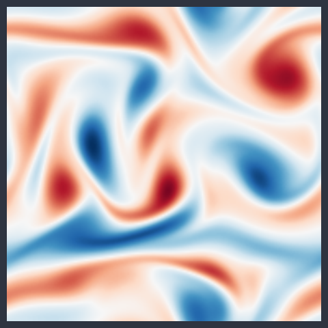
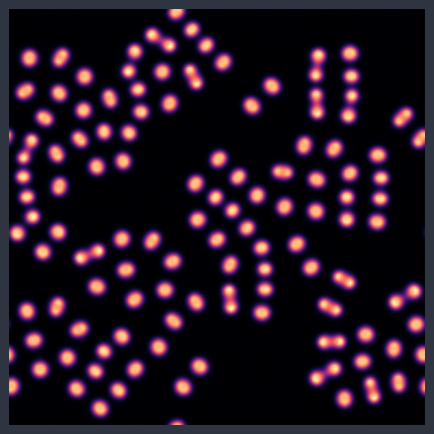
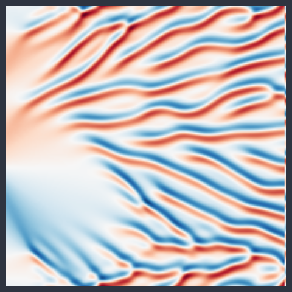
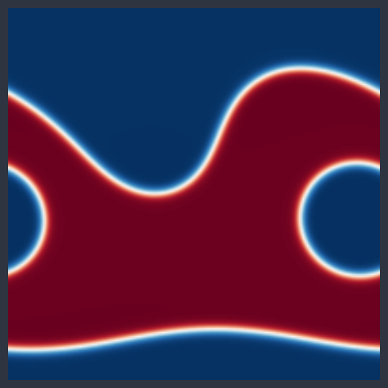
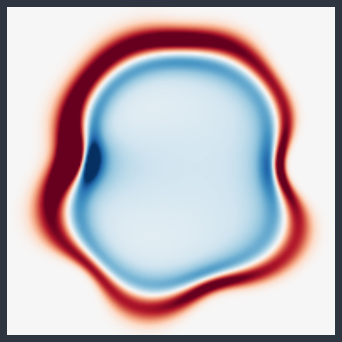
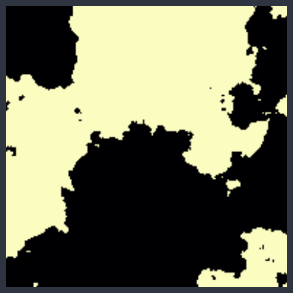
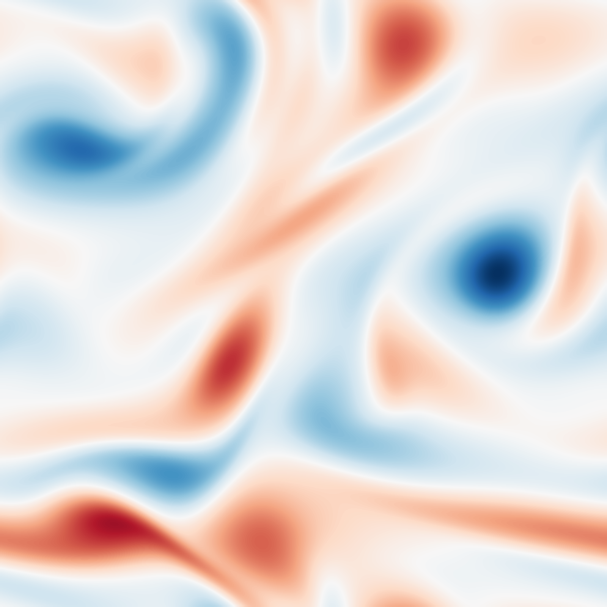
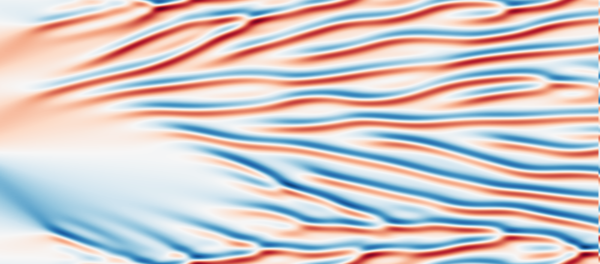
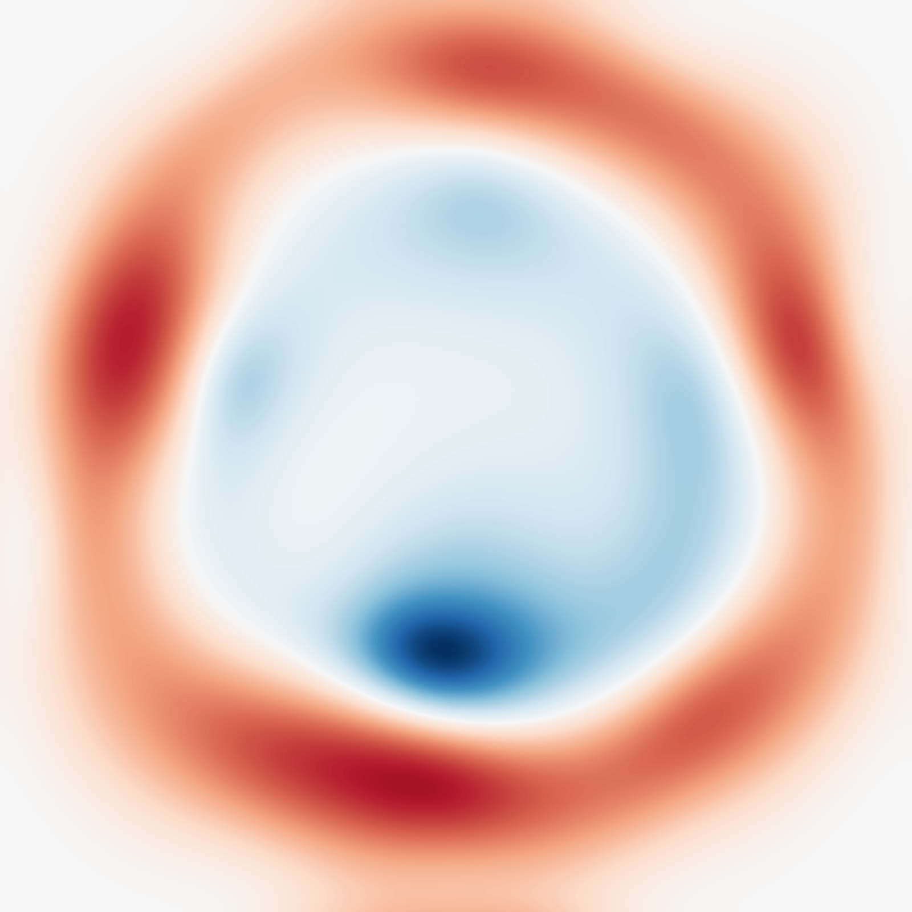
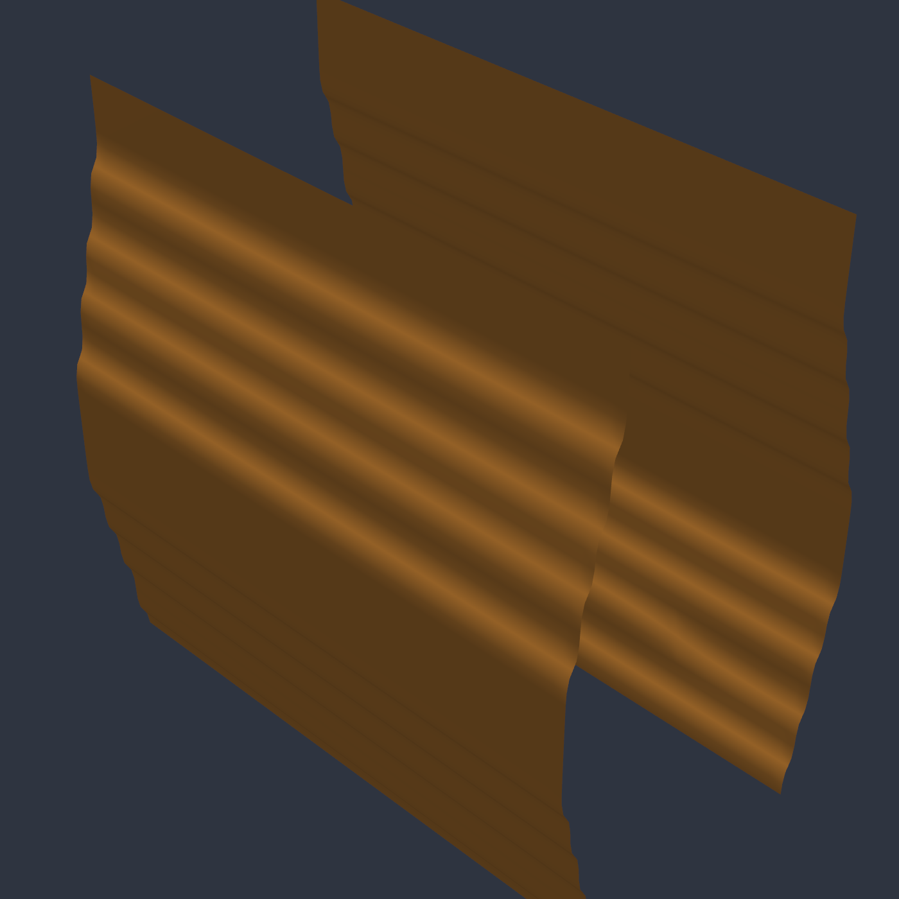

---
hide:
  - toc
---

# Gallery

*Everything below is package output.*

## Motion

<figure class="pf-motion-item" markdown>
<video autoplay loop muted playsinline>
<source src="../figures/fhn_spiral_motion.mp4" type="video/mp4">
</video>
<figcaption>FitzHugh–Nagumo waves (<code>fitzhugh_nagumo_2d</code>) — <strong><code>beta</code> sets the excitability: fronts curl or retract</strong></figcaption>
</figure>
<figure class="pf-motion-item" markdown>
<video autoplay loop muted playsinline>
<source src="../figures/gray_scott_motion.mp4" type="video/mp4">
</video>
<figcaption>Gray–Scott mitosis (<code>gray_scott_2d</code>) — <strong><code>n_patches</code> sets how many seeds start the growth</strong></figcaption>
</figure>
<figure class="pf-motion-item" markdown>
<video autoplay loop muted playsinline>
<source src="../figures/kolmogorov_motion.mp4" type="video/mp4">
</video>
<figcaption>Forced 2D turbulence (<code>kolmogorov_flow_2d</code>, JAX backend) — <strong><code>forcing_wavenumber</code> sets the number of forcing bands</strong></figcaption>
</figure>
<figure class="pf-motion-item" markdown>
<video autoplay loop muted playsinline>
<source src="../figures/shallow_water_motion.mp4" type="video/mp4">
</video>
<figcaption>Shallow-water waves (<code>shallow_water_2d</code>) — <strong><code>gravity</code> and <code>mean_depth</code> set the wave speed</strong></figcaption>
</figure>
<figure class="pf-motion-item pf-wide" markdown>
<video autoplay loop muted playsinline>
<source src="../figures/cylinder_turbulent_motion.mp4" type="video/mp4">
</video>
<figcaption>Re 2000 wake vorticity, base shear removed (<code>cylinder_flow_2d_turbulent</code>, LES) — <strong>the cylinder position (<code>cx</code>, <code>cy</code>) is a per-sample input</strong></figcaption>
</figure>

## Stills

<figure markdown>

<figcaption>Kolmogorov vorticity</figcaption>
</figure>
<figure markdown>

<figcaption>Gray–Scott labyrinth</figcaption>
</figure>
<figure markdown>

<figcaption>Kuramoto–Sivashinsky</figcaption>
</figure>
<figure markdown>

<figcaption>Spinodal maze</figcaption>
</figure>
<figure markdown>

<figcaption>Waves in a random medium</figcaption>
</figure>
<figure markdown>

<figcaption>Darcy permeability field</figcaption>
</figure>

<figure markdown>

<figcaption>Forced 2D turbulence (<code>kolmogorov_flow_2d</code>) — <strong><code>viscosity</code> sets the Reynolds number</strong></figcaption>
</figure>
<figure markdown>

<figcaption>Gray–Scott patterns (<code>gray_scott_2d</code>) — <strong>every (<code>feed</code>, <code>kill</code>) pair grows a different pattern</strong></figcaption>
</figure>
<figure markdown>

<figcaption>Kuramoto–Sivashinsky, x vs t (<code>ks_1d</code>) — <strong>chaos develops for domain sizes L ≳ 20</strong></figcaption>
</figure>
<figure markdown>

<figcaption>Waves in a random medium (<code>heterogeneous_wave_2d</code>) — <strong><code>c_min</code>/<code>c_max</code> set the medium's speed contrast</strong></figcaption>
</figure>
<figure markdown>

<figcaption>Darcy pressure in 3D (<code>darcy_fno_3d</code>) — <strong><code>tau</code> sets the coefficient correlation length</strong></figcaption>
</figure>
<figure markdown>

<figcaption>Spinodal interface in 3D (<code>cahn_hilliard</code>) — <strong>the same model runs 2D or 3D from <code>resolution</code></strong></figcaption>
</figure>

