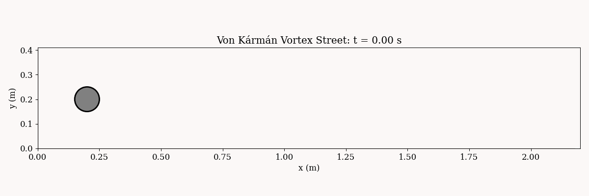

# PDEForge

**PDE training data from one command — 37 models, calibration-ready splits,
FEM without installing FEniCS.**

```bash
docker run -v $PWD/data:/data ghcr.io/pyatsysh/pdeforge:fenicsx \
    pdeforge generate --model naca_flow_2d --n 200 \
    --resolution x=96 y=48 --seed 0 --out /data/naca
```

Pull the image on any machine with Docker and watch an airfoil dataset
appear from one line: per-sample NACA geometry, meshed and solved, with
velocity/pressure fields, an SDF geometry channel, lift and drag
coefficients, and full provenance metadata.


## What PDEForge is

A unified framework for generating PDE datasets for operator learning and
uncertainty quantification. One call — `generate_dataset()` in Python or
`pdeforge generate` on the command line — serves every model, at any
resolution, with any parameters, seeded and reproducible:

```python
import pdeforge

data = pdeforge.generate_dataset("ns_vorticity_2d", n_samples=1000,
                                 resolution={"x": 128, "y": 128}, seed=0)
splits = data.split(train=0.6, val=0.15, cal=0.15, test=0.1)
```

- **37 models**: spectral (Burgers, Navier-Stokes vorticity, Kolmogorov
  flow, Kuramoto-Sivashinsky, KdV, Schrodinger, shallow water, Gray-Scott,
  phase-field families, stochastic PDEs, 3D diffusion and Allen-Cahn),
  finite-difference elliptic (the canonical Darcy benchmark, 2D and 3D),
  and finite-element flows (cylinder families, LES turbulence, NACA
  airfoils) — see [Available Models](guide/models.md).
- **The canon, regenerable**: classic benchmark setups ship as presets with
  every hyperparameter exposed. The Darcy generator reproduces the
  distributed FNO data to 0.49% relative L2, with the input measure
  recovered from the data itself (spectrum fit R^2 = 0.998) — and extends
  the same measure to 3D, where no frozen dataset exists.
- **UQ-native**: dedicated calibration splits for conformal prediction,
  out-of-distribution splits by parameter range, multi-fidelity pairs,
  observation operators — see the [Calibration Protocol](guide/calibration.md).
- **Verified ground truth**: `pdeforge.verify` runs convergence studies so
  the data comes with numerical error estimates; every model carries a
  physics-validation test (conservation laws, exact solutions).
- **Fast when you want it**: process-parallel generation, an optional
  jit+vmap JAX backend (GPU-capable; ~16x CPU measured), and
  chunked-to-disk streaming with no RAM ceiling.
- **Reproducible by construction**: `pdeforge reproduce metadata.json`
  regenerates any seeded dataset from its own metadata. The container pins
  the environment; the metadata pins the run.

## Gallery

Every image below is package output — regenerate them all with
`python scripts/make_gallery.py`.


| | |
|---|---|
|  |  |
| Forced 2D turbulence (`kolmogorov_flow_2d`, JAX backend) | Gray-Scott mitosis regime (`gray_scott_2d`) |
|  |  |
| Spatiotemporal chaos, x vs t (`ks_1d`) | Wavefronts refracting through a random medium (`heterogeneous_wave_2d`) |
|  |  |
| Canonical Darcy pressure in 3D (`darcy_fno_3d`) | The u = 0 interface of 3D spinodal decomposition (`cahn_hilliard`) |


*von Karman vortex street (`cylinder_flow_2d_unsteady`)*

## Install

```bash
pip install pdeforge            # spectral models: NumPy/SciPy only
pip install pdeforge[jax]       # + GPU-capable backend
docker pull ghcr.io/pyatsysh/pdeforge:fenicsx   # everything, zero install
```

Start with the [Quick Start](getting-started/quickstart.md), compare
against the alternatives in [Comparison](comparison.md), or read how the
calibration split keeps conformal guarantees honest in the
[Calibration Protocol](guide/calibration.md).
