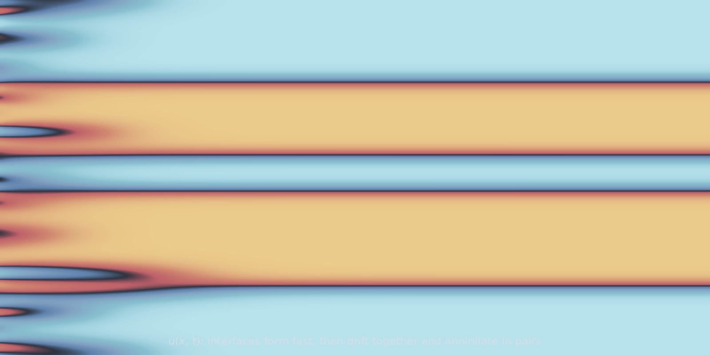

# Allen-Cahn 1D (`allen_cahn_1d`)

Phase separation with non-conserved dynamics. The double-well potential
$f(u) = (1 - u^2)^2/4$ has minima at $u = \pm 1$, so an arbitrary initial field
is driven towards a piecewise-constant state joined by interfaces of width
$O(\sqrt{\varepsilon})$. What an operator has to learn here is where the
interfaces end up, and that is a discrete outcome hiding inside a smooth map:
two nearby initial conditions can put an interface in different places, or
leave one out entirely.

<figure class="pf-model-fig" markdown>

<figcaption>Space-time diagram of u(x, t) (<code>allen_cahn_1d</code>): interfaces form quickly, then drift together and annihilate in pairs.</figcaption>
</figure>

## Equation

$$\frac{\partial u}{\partial t}
= \varepsilon\,\frac{\partial^2 u}{\partial x^2} + u - u^3$$

with periodic boundary conditions.

## Operator learning task

$$u(x, 0) \mapsto u(x, T)$$

## Parameters

| Parameter | Default | Range | Description |
|-----------|---------|-------|-------------|
| `epsilon` | 0.01 | (0.001, 0.5) | Interface width; smaller gives sharper phase boundaries |
| `time_end` | 10.0 | (0.1, 100.0) | Final time; longer gives more complete separation |

## Usage

```python
from pdeforge import generate_dataset

dataset = generate_dataset(
    model="allen_cahn_1d",
    n_samples=1000,
    resolution={"x": 256},
    params={"epsilon": 0.01, "time_end": 10.0},
    seed=42,
)
```

## Solver

ETDRK4 on the spectral seam, with the linear part of the reaction folded into
the exactly integrated operator alongside diffusion. Only the cubic term is
stepped explicitly.

## Behaviour

Two stages, on very different timescales. Interfaces form fast, in a time set
by the linear growth rate of the unstable $u = 0$ state. After that the
dynamics are slow: interfaces move by curvature, drift together and annihilate
in pairs, and the number of domains falls logarithmically. Choosing
`time_end` therefore chooses which of those two problems the dataset poses.

Small $\varepsilon$ needs resolution to match. The interface is
$O(\sqrt{\varepsilon})$ wide, so at $\varepsilon = 0.001$ on 256 points the
transition spans only a few cells, and the sampled data starts to depend on
where the grid happens to fall.

## Data shapes

```python
dataset.inputs.shape   # (n_samples, nx)
dataset.outputs.shape  # (n_samples, nx)
```

## Related

- [`allen_cahn_2d`](allen_cahn_2d.md), [`allen_cahn_3d`](allen_cahn_3d.md): the
  same equation with curvature-driven coarsening in higher dimensions.
- [`cahn_hilliard`](cahn_hilliard.md): the conserved counterpart, where the
  mean composition is preserved exactly.
- [`stochastic_allen_cahn_2d`](stochastic_allen_cahn_2d.md): noise-driven
  selection between the wells, which is where the outcome becomes genuinely
  random.
