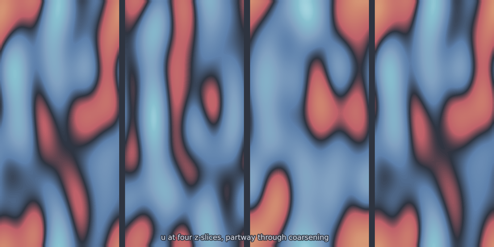

# Allen-Cahn 3D (`allen_cahn_3d`)

Non-conserved phase separation in three dimensions. Domains of the $\pm 1$
wells coarsen by mean-curvature flow of their interfaces, which are now
surfaces. The physics is the same as in [`allen_cahn_2d`](allen_cahn_2d.md);
what changes is that the interface is a two-dimensional object embedded in a
volume, so the fraction of the grid carrying the useful signal falls again.

<figure class="pf-model-fig" markdown>

<figcaption>Four evenly spaced z-slices of the coarsened phase field (<code>allen_cahn_3d</code>).</figcaption>
</figure>

## Equation

$$\frac{\partial u}{\partial t} = \varepsilon\,\nabla^2 u + u - u^3$$

on the periodic cube.

## Operator learning task

$$u(x, y, z, 0) \mapsto u(x, y, z, T)$$

## Parameters

| Parameter | Default | Range | Description |
|-----------|---------|-------|-------------|
| `epsilon` | 0.01 | (0.001, 0.5) | Interface width |
| `time_end` | 5.0 | (0.1, 100.0) | Final time |

## Usage

```python
from pdeforge import generate_dataset

dataset = generate_dataset(
    model="allen_cahn_3d",
    n_samples=200,
    resolution={"x": 64, "y": 64, "z": 64},
    params={"epsilon": 0.01, "time_end": 5.0},
    seed=42,
    to="ac3d.h5",     # chunked to disk
)
```

## Solver

ETDRK4 on the dimension-agnostic seam, exactly as in one and two dimensions:
the linear operator including the linear part of the reaction is integrated
exactly, the cubic term explicitly.

!!! warning "Mind the memory"
    A $64^3$ float64 field is 2 MB, so inputs and outputs together are 4 MB per
    sample. Pass `to=` for anything past a few hundred samples and let the
    generator stream chunks to disk.

## Behaviour

Interfaces occupy a shrinking share of the volume as $\varepsilon$ falls: at
$\varepsilon = 0.01$ on a $64^3$ grid, the transition region is a few cells
thick around surfaces that themselves cover a small part of the box. Most
voxels sit at $\pm 1$ and carry no information, which flatters any error metric
averaged over the volume. Score on the interface region if the interface is
what you care about.

## Data shapes

```python
dataset.inputs.shape   # (n_samples, nz, ny, nx)
dataset.outputs.shape  # (n_samples, nz, ny, nx)
```

## Related

- [`allen_cahn_1d`](allen_cahn_1d.md), [`allen_cahn_2d`](allen_cahn_2d.md):
  the lower-dimensional versions.
- [`cahn_hilliard`](cahn_hilliard.md): runs in 3D from the same code path, with
  conserved dynamics.
- [`heat_3d`](heat_3d.md): the linear volumetric baseline.
