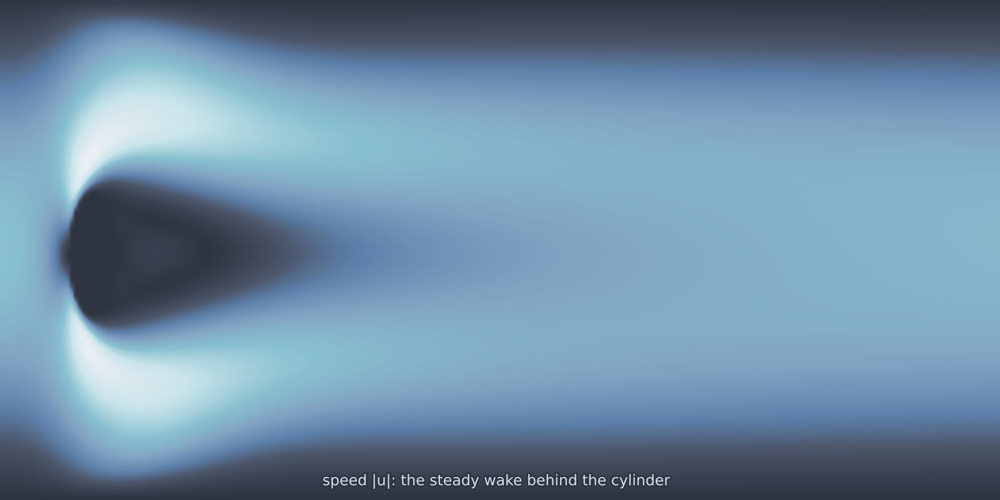

# Cylinder Flow 2D (`cylinder_flow_2d`)

Flow past a circular cylinder in a channel: the reference geometry of
computational fluid dynamics, and the point where PDEForge stops being a
spectral package. There are walls here, and a hole in the domain, so the
solution lives on an unstructured mesh and is interpolated onto the output
grid rather than computed there.

<figure class="pf-model-fig" markdown>

<figcaption>Speed at the default condition (<code>cylinder_flow_2d</code>): the steady, symmetric wake behind the cylinder.</figcaption>
</figure>

## Equations

$$\rho\,(\mathbf{u} \cdot \nabla)\,\mathbf{u} - \mu\,\nabla^2 \mathbf{u} + \nabla p = 0,
\qquad \nabla \cdot \mathbf{u} = 0$$

Boundary conditions: a parabolic profile at the inlet, zero stress at the
outlet, and no slip on both the channel walls and the cylinder surface.

## Operator learning task

$$\text{inlet scale} \mapsto (u, v, p)$$

## Parameters

| Parameter | Default | Range | Description |
|-----------|---------|-------|-------------|
| `viscosity` | 0.001 | (1e-5, 0.1) | Dynamic viscosity $\mu$ |
| `inlet_velocity` | 0.3 | (0.01, 2.0) | Mean inlet velocity |
| `cylinder_radius` | 0.05 | (0.01, 0.1) | Cylinder radius |

## Usage

This model needs FEniCSx. See [FEniCSx setup](../getting-started/fenicsx.md).

```python
from pdeforge import generate_dataset

dataset = generate_dataset(
    model="cylinder_flow_2d",
    n_samples=50,
    resolution={"x": 128, "y": 64},
    params={"viscosity": 0.001, "inlet_velocity": 0.3},
    seed=42,
)
```

## Solver

Finite elements through FEniCSx: Taylor-Hood P2/P1 for velocity and pressure,
a Newton solver for the nonlinear terms, and gmsh for meshing the channel with
its cylindrical hole.

## Domain

The default channel is 2.2 by 0.41 with the cylinder centred at (0.2, 0.2),
which is the standard DFG benchmark geometry.

## Behaviour

At low Reynolds number the wake is steady and symmetric, which is what this
model is for. Raising Reynolds eventually breaks that symmetry and then starts
shedding vortices, at which point a steady solve has no solution to find and
[`cylinder_flow_2d_unsteady`](cylinder_flow_2d_unsteady.md) is the model you
want instead.

## Data shapes

```python
dataset.inputs.shape   # (n_samples, 1)            the inlet scale
dataset.outputs.shape  # (n_samples, nx, ny, 3)    u, v, p
```

Solutions are interpolated from the unstructured mesh onto the regular grid,
and points inside the cylinder are filled with zeros. The `domain_mask` in the
metadata marks which grid points are genuinely in the fluid, and any error
metric should be computed against that mask rather than the full array.

## Related

- [`cylinder_flow_2d_unsteady`](cylinder_flow_2d_unsteady.md): the
  time-dependent version, with vortex shedding.
- [`cylinder_flow_2d_parameterized`](cylinder_flow_2d_parameterized.md): the
  cylinder position becomes an input.
- [`cylinder_flow_2d_turbulent`](cylinder_flow_2d_turbulent.md): Re 2000 under
  a large-eddy closure.
- [`naca_flow_2d`](naca_flow_2d.md): the same solver family around an airfoil.
