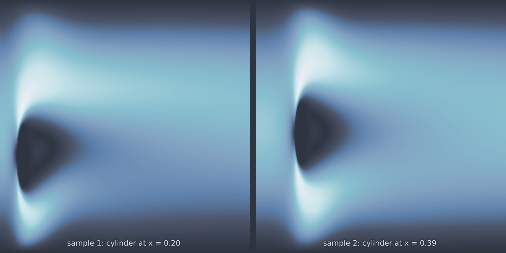

# Cylinder Flow 2D parameterized (`cylinder_flow_2d_parameterized`)

The same steady solve as [`cylinder_flow_2d`](cylinder_flow_2d.md) with the
cylinder position promoted to an input. Moving the obstacle changes the
geometry, so the mesh is rebuilt per sample and the flow field that comes back
is genuinely a different problem's solution rather than a rescaling of one
reference flow. That is what makes it useful: the operator has to learn how
geometry maps to flow, which is the hard part of most engineering surrogates.

<figure class="pf-model-fig" markdown>

<figcaption>Two samples with the cylinder at different positions (<code>cylinder_flow_2d_parameterized</code>): the wake follows the obstacle.</figcaption>
</figure>

## Equations

$$\rho\,(\mathbf{u} \cdot \nabla)\,\mathbf{u} - \mu\,\nabla^2 \mathbf{u} + \nabla p = 0,
\qquad \nabla \cdot \mathbf{u} = 0$$

with a parabolic inlet, zero-stress outlet, and no slip on the walls and the
cylinder.

## Operator learning task

$$(\text{inlet scale},\ c_x,\ c_y) \mapsto (u, v, p)$$

## Parameters

| Parameter | Default | Range | Description |
|-----------|---------|-------|-------------|
| `inlet_velocity` | 0.3 | (0.01, 2.0) | Mean inlet velocity |
| `viscosity` | 0.001 | (1e-5, 0.1) | Dynamic viscosity |
| `cylinder_radius` | 0.05 | (0.01, 0.1) | Cylinder radius |
| `cx_range` | (0.15, 0.5) | | Draw range for the cylinder $x$ position |
| `cy_range` | (0.15, 0.26) | | Draw range for the cylinder $y$ position |

The `cy_range` is deliberately narrow, since the channel is only 0.41 tall and
a cylinder of radius 0.05 placed near a wall leaves a gap the mesh has to
resolve. Widening it is possible, and will make meshing harder.

## Usage

This model needs FEniCSx. See [FEniCSx setup](../getting-started/fenicsx.md).

```python
from pdeforge import generate_dataset

dataset = generate_dataset(
    model="cylinder_flow_2d_parameterized",
    n_samples=200,
    resolution={"x": 110, "y": 41},
    params={"viscosity": 0.001, "cx_range": (0.15, 0.5)},
    seed=42,
)
```

## Solver

As in the fixed-position model: Taylor-Hood P2/P1 elements, Newton for the
nonlinearity, gmsh for the mesh. The mesh is regenerated for each new cylinder
position, which is most of the per-sample cost.

## Behaviour

Because the obstacle moves, the region occupied by fluid differs from sample
to sample and the `domain_mask` differs with it. Averaging error over the full
grid mixes fluid points with points that are inside the cylinder in some
samples and outside it in others, which is worth avoiding.

Cylinder position near the inlet leaves a longer channel for the wake to
develop in; near the outlet the wake is truncated by the boundary. Those are
visibly different flows, and the position range therefore controls how varied
the dataset is.

## Data shapes

```python
dataset.inputs.shape   # (n_samples, 3)            inlet scale, cx, cy
dataset.outputs.shape  # (n_samples, nx, ny, 3)    u, v, p
```

## Related

- [`cylinder_flow_2d`](cylinder_flow_2d.md): the fixed-position steady solve.
- [`cylinder_flow_2d_turbulent`](cylinder_flow_2d_turbulent.md): the same
  position parameterisation at Re 2000, unsteady.
- [`naca_flow_2d`](naca_flow_2d.md): geometry as input, taken further: the
  shape itself is drawn per sample.
