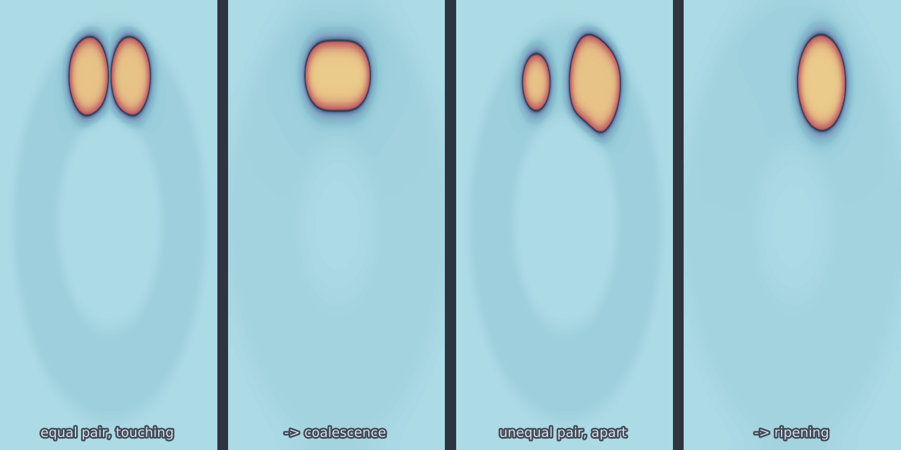
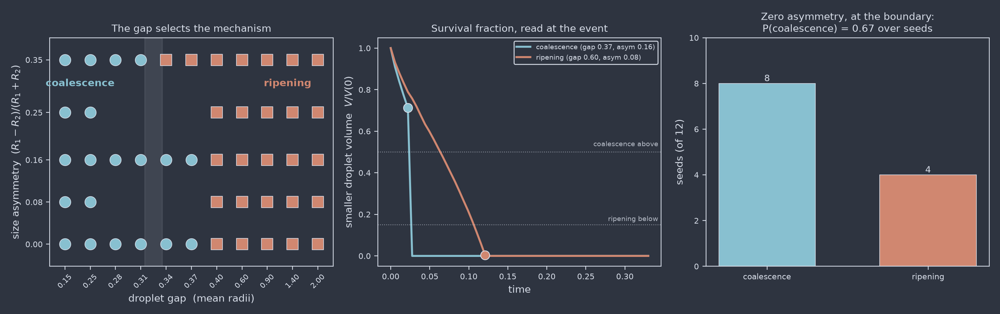

# Egg-shell droplets (`eggshell_droplets_3d`)

Two droplets coarsen inside the active shell of a catalyst pellet, and the
model asks which of the two coarsening mechanisms carries them off. This is the
classical dichotomy in supported-catalyst sintering, posed at the smallest
system in which the two are separable:

* **Ostwald ripening.** The droplets stay put and exchange material by
  diffusion through the matrix. The Gibbs-Thomson effect puts the chemical
  potential at a droplet of radius $R$ at $\sigma/R$, so the smaller partner
  sits at the higher potential, dissolves, and feeds the larger one.
* **Coalescence.** The droplets touch, the interface between them bridges, and
  the pair merges with both partners still substantially intact.

<figure class="pf-model-fig" markdown>

<figcaption>The two regimes, sliced through the plane containing both droplet
centres. Left pair: equal droplets already touching merge with both partners
intact. Right pair: unequal droplets held apart — the smaller one dissolves
where it stands and never moves.</figcaption>
</figure>

Both are already contained in the Cahn-Hilliard equation; neither has to be
added. Exactly two droplets is the smallest configuration that separates them,
and 3D is the dimension in which the question is well posed — the quasi-static
diffusion field around a droplet falls off as $1/r$ in three dimensions and so
has a proper isolated limit, where in two dimensions it is logarithmic, no
isolated droplet exists, and ripening rates depend on the size of the box.

## Equation

$$\frac{\partial u}{\partial t} = \nabla\cdot\!\left(M(\mathbf{x})\,\nabla\mu\right),
\qquad \mu = u^3 - u - \varepsilon^2\nabla^2 u$$

The geometry rides on the mobility rather than on the boundary conditions:

$$M(\mathbf{x}) = M_0\left[\phi_0 + (1-\phi_0)\,\psi(\mathbf{x})\right]$$

where $\psi$ is a smoothed indicator of the spherical shell
$r_{\text{in}}(\hat{n}) \le |\mathbf{x}| \le r_{\text{out}}$ and
$\phi_0 \ll 1$ is the residual mobility of the inert support core. Where $M$
is negligible there is no flux, so the core and the pellet exterior are frozen
at $u=-1$ and every bit of transport happens in the shell. That is what an
egg-shell catalyst is: an impermeable core with the active phase confined to a
thin outer layer.

Two consequences are worth stating plainly.

**Mass is conserved exactly.** The right-hand side is assembled in flux form,
so the $k=0$ Fourier mode of the update is identically zero and the drift is
round-off — not a tolerance that has to be tuned, and not something the
geometry or the noise can spoil.

**The shell is integrated by the standard stepper.** For constant $M$ the flux
form telescopes to $-M k^2 \hat{\mu}$ and the stabilised IMEX step becomes the
[`cahn_hilliard`](cahn_hilliard.md) update exactly, numerator and denominator
alike. Since $M = M_0$ throughout the active shell, the variable coefficient is
only ever felt where nothing is happening.

The shell is also a closed domain, so unlike a periodic box there are no
periodic-image artefacts in the diffusion field: the two droplets see each
other around the sphere both ways, and the reservoir available to them is
finite and known.

## Operator learning task

$$\left(u(\mathbf{x},0),\; M(\mathbf{x})\right) \mapsto u(\mathbf{x},T)$$

The shell geometry travels with the sample as a second input channel. With
`shell_roughness` on it differs from sample to sample, and a surrogate cannot
predict the dynamics without it.

The outcome bifurcates: a small change in the initial configuration flips the
pair between macroscopically different end states. That makes the map a
deliberately hard one to learn and a sharp test of whether a surrogate's
uncertainty is honest near the boundary.

## Parameters

| Parameter | Default | Range | Description |
|-----------|---------|-------|-------------|
| `epsilon` | 0.010 | (0.006, 0.03) | Interface width; $\sigma = 2\sqrt{2}\varepsilon/3$ |
| `mobility` | 1.0 | (0.01, 10.0) | Mobility $M_0$ in the active shell |
| `shell_outer` | 0.44 | (0.15, 0.48) | Outer pellet radius, box units |
| `shell_thickness` | 0.20 | (0.02, 1.0) | Active layer thickness — the confinement knob |
| `shell_roughness` | 0.0 | (0.0, 0.6) | Relative amplitude of random thickness variation |
| `droplet_radius` | 0.09 | (0.02, 0.14) | Mean droplet radius $\bar{R}$ |
| `size_asymmetry` | 0.15 | (0.0, 0.5) | $(R_1-R_2)/(R_1+R_2)$ — the ripening drive |
| `droplet_gap` | 1.0 | (0.05, 6.0) | Surface-to-surface gap in units of $\bar{R}$ |
| `noise_intensity` | 0.0 | (0.0, 1e-5) | Conserved thermal noise $\Theta$ |
| `time_end` | 0.4 | (0.001, 5.0) | Final time |

### Which knob selects the regime

**`droplet_gap` decides the outcome, and it decides it almost alone.** A sweep
of gap against asymmetry at $128^3$ puts the boundary between $0.25$ and
$0.40\,\bar{R}$ at *every* asymmetry tested, from 0 to 0.35:

| asym \ gap | 0.15 | 0.25 | 0.40 | 0.60 | 0.90 | 1.40 | 2.00 |
|---|---|---|---|---|---|---|---|
| 0.00 | coal | coal | ripe | ripe | ripe | ripe | ripe |
| 0.08 | coal | coal | ripe | ripe | ripe | ripe | ripe |
| 0.16 | coal | coal | ripe | ripe | ripe | ripe | ripe |
| 0.25 | coal | coal | ripe | ripe | ripe | ripe | ripe |
| 0.35 | coal | coal | ripe | ripe | ripe | ripe | ripe |

The reason is a separation of timescales, and it is worth being explicit about
because it is easy to expect otherwise. Bridging is an interface-relaxation
process: once the diffuse interfaces overlap it completes in a time set by
$\varepsilon$ and the mobility, far faster than anything diffusive. Ripening
is diffusive, taking $t \sim 2R^3/(M\sigma)$. So wherever bridging is possible
at all it wins outright, whatever the Gibbs-Thomson difference between the
partners, and wherever it is not, ripening is the only channel left.

**`size_asymmetry` sets the ripening rate, not the winner.** It controls the
driving force $\sigma(1/R_2 - 1/R_1)$, and so how fast the ripening branch
runs to completion and how far the survival fraction falls — but it only moves
the boundary itself in the narrow window where the two timescales are
comparable. At zero asymmetry there is no ripening drive at all, which makes
that row a special case worth reading the warning below about.

**`shell_thickness` favours ripening as it tightens**, which is the opposite of
what the confinement argument first suggests. Measured at gap $0.31$,
asymmetry $0.16$, the survival fraction falls monotonically as the shell
closes in:

| shell thickness | 0.10 | 0.14 | 0.20 | 0.28 |
|---|---|---|---|---|
| $\rho$ | 0.853 | 0.884 | 0.910 | 0.922 |

Squeezing the droplets into lenses raises the curvature at their rims, and so
the Gibbs-Thomson potential driving the exchange; and it turns the diffusion
field between them quasi-two-dimensional, which decays more slowly with
distance than the three-dimensional $1/r$ field. Both accelerate ripening, so
the smaller droplet has given up more of itself by the time the pair merges.
Like asymmetry, though, the effect is on the rate: every thickness in that
range still coalesced at this gap, and at a gap well outside the coalescence
window every thickness from 0.08 to 0.28 still ripened.

!!! warning "Zero asymmetry is an unstable equilibrium"
    At `size_asymmetry = 0` the partners are identical, so there is no
    Gibbs-Thomson difference and nothing selects which of them dissolves. The
    pair sits on a knife edge, and in a deterministic run the tie is broken by
    the grid — the two centres fall at different sub-cell offsets — which is an
    artefact, not physics. Runs on that line still terminate, and they are
    still labelled, but the label says more about the discretisation than about
    the material. This is precisely what `noise_intensity` is for: with
    conserved thermal noise the symmetry is broken physically and the outcome
    becomes a distribution over seeds rather than a single answer. Away from
    the line, the asymmetry dominates any grid effect and deterministic runs
    are meaningful on their own.

!!! note "The matrix does not start at $u=-1$"
    A droplet of radius $R$ is only in local equilibrium with a matrix at
    $-1 + \sigma/(2R)$. Against a matrix at exactly $-1$ both droplets simply
    evaporate, and since the shell reservoir is far larger than the droplets
    they evaporate completely. The shell matrix is therefore seeded at the
    Gibbs-Thomson supersaturation for the *mean* radius, which puts the
    critical radius at $\bar{R}$ and makes this an exchange problem — larger
    droplet grows, smaller dissolves — rather than a dissolution problem.

    That level is the *linearised* Gibbs-Thomson value, taken about $u=-1$,
    and the droplets are lenses rather than spheres once the shell confines
    them, so it is close to the true equilibrium but not equal to it. The
    residue shows up as a slow net transfer of droplet material into the
    shell matrix over a run. It does not affect which mechanism ends the pair,
    which is what the classification reads, but it does mean the total droplet
    volume is not itself a conserved quantity — only $\int u$ is.

!!! note "Resolution follows epsilon"
    The interface needs about four points across it, so $\varepsilon \gtrsim
    1.3\,\Delta x$, and quantitative Gibbs-Thomson wants $R/\varepsilon
    \gtrsim 8$. The defaults are tuned for $128^3$.

## Regime classification

Every run is classified automatically. Connected components of $\{u>0\}$ are
tracked frame by frame and the pair is labelled at the moment the count drops
from two to one, using two independent signals.

**Where did the material go?** Across the event the survivor either takes on
the smaller droplet's remaining volume — which is what merging means — or it
does not, in which case the matrix took it. This carries the primary decision,
because it is a conservation statement across a single event rather than a
rate, and so stays reliable however coarsely the trajectory was sampled. That
robustness is not optional: a dissolving droplet's last moments are abrupt, so
its final recorded volume can be large simply because the frame before it
vanished caught it early.

**How much was left to take part?** The survival fraction

$$\rho = \frac{V_{\text{small}}(t_{\text{event}})}{V_{\text{small}}(0)}$$

then grades the merger, separating a genuine merger of two healthy droplets
from an already-dissolving remnant being mopped up. It is a continuous regime
coordinate, not just a label:

| $\rho$ | absorbed | Regime |
|--------|----------|--------|
| $< 0.15$ | ignored | `ripening` — nothing left to merge with |
| $\ge 0.5$ | yes | `coalescence` |
| $0.15$–$0.5$ | yes | `mixed` — merged, but only after substantial ripening |
| $\ge 0.15$ | no | `ripening` |
| — | pair still intact at $T$ | `unresolved` |

The first row is a guard, not a tie-break. The absorbed fraction divides by
what remains of the smaller droplet, so once that is a per cent or two of the
original the survivor's ordinary ripening growth over a single frame is
comparable to the whole denominator and absorption reads near 1 for reasons
that have nothing to do with a merger. A pair that ripened down to a remnant
ripened, whatever swallowed the last of it.

Centroid approach is reported as a third, weaker signal: coalescing droplets
migrate together, ripening ones stay put.

Diagnostics from the last solve — per-frame volumes, component counts,
centroid separations, and the labels above — are left on
`model.last_diagnostics`.

## Usage

```python
from pdeforge import get_model

model = get_model("eggshell_droplets_3d")(
    resolution={"x": 128, "y": 128, "z": 128},
    size_asymmetry=0.25,
    droplet_gap=1.0,
)
ic = model.generate_ic(seed=0)      # (2, 128, 128, 128): u0 and M
u_T = model.solve(ic)
print(model.last_diagnostics["regime"])       # -> 'ripening'
```

Selecting the other regime is a matter of removing the ripening drive and
letting the interfaces touch:

```python
model = get_model("eggshell_droplets_3d")(
    resolution={"x": 128, "y": 128, "z": 128},
    size_asymmetry=0.0,     # no Gibbs-Thomson difference between partners
    droplet_gap=0.15,       # interfaces already overlapping
    time_end=0.05,
)
ic = model.generate_ic(seed=0)
model.solve(ic)
print(model.last_diagnostics["regime"])       # -> 'coalescence'
```

## Measured behaviour

<figure class="pf-model-fig" markdown>

<figcaption>Left: the regime as a function of gap and asymmetry at 128<sup>3</sup>,
with the boundary band shaded. Centre: the smaller droplet's volume through a
run of each kind, with the survival fraction read at the marked event. Right:
on the zero-asymmetry line, where the deterministic problem is a knife edge,
conserved noise turns the outcome into a distribution over seeds.</figcaption>
</figure>

The boundary is sharp and lives in the gap, but it is not vertical. Resolving
the window between $0.28$ and $0.40$ shows it tilting with asymmetry, exactly
where the two timescales become comparable:

| gap | asym 0.00 | asym 0.16 | asym 0.35 |
|---|---|---|---|
| 0.28 | coal | coal | coal |
| 0.31 | coal ($\rho$ 0.951) | coal (0.910) | coal (0.787) |
| 0.34 | coal (0.951) | coal (0.907) | **ripe** (0.056) |
| 0.37 | coal (0.886) | coal (0.712) | **ripe** (0.049) |
| 0.40 | ripe | ripe | ripe |

Raising the asymmetry from 0 to 0.35 moves the boundary from between
$0.37$–$0.40$ down to between $0.31$–$0.34$. Inside the coalescence region the
survival fraction falls steadily with asymmetry at fixed gap, so the
continuous coordinate registers the competition long before the label does.

Away from that band the outcome is either essentially 1 — both partners intact
at the merger — or below 0.1, with very little in between, which is what makes
the classification robust rather than a matter of where a threshold sits.

Mass drift over all 56 runs peaked at $1.1\times10^{-16}$.

## Validation

The model carries the invariants that pin it down:

* mass conserved to machine precision, with and without noise and roughness;
* free energy monotonically decreasing, since
  $dF/dt = -\int M|\nabla\mu|^2 \le 0$ for any non-negative mobility;
* the constant-mobility step reproducing the `cahn_hilliard` update to
  $4\times10^{-16}$;
* the smaller droplet being the one that dissolves, as Gibbs-Thomson requires;
* both regimes reachable, and selected by the documented knobs.
