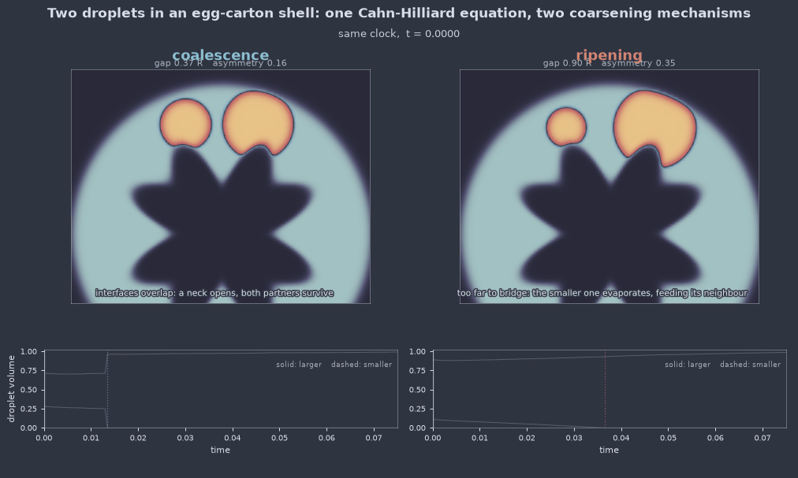

# Egg-shell droplets (`eggshell_droplets_3d`)

Two droplets coarsen inside the active shell of a catalyst pellet, and the
model asks which of the two coarsening mechanisms carries them off. This is the
classical dichotomy in supported-catalyst sintering, posed at the smallest
system in which the two are separable:

* **Ostwald ripening.** The droplets stay put and exchange material by
  diffusion through the matrix. The Gibbs-Thomson effect puts the chemical
  potential at a droplet of radius $R$ at $\sigma/R$, so the smaller partner
  sits at the higher potential, dissolves, and feeds the larger one.
* **Coalescence.** The droplets touch, the interface between them bridges, and
  the pair merges with both partners still substantially intact.

<figure class="pf-model-fig" markdown>

<figcaption>The two regimes, sliced through the plane containing both droplet
centres. Left pair: equal droplets already touching merge with both partners
intact. Right pair: unequal droplets held apart — the smaller one dissolves
where it stands and never moves.</figcaption>
</figure>

Both are already contained in the Cahn-Hilliard equation; neither has to be
added. Exactly two droplets is the smallest configuration that separates them,
and 3D is the dimension in which the question is well posed — the quasi-static
diffusion field around a droplet falls off as $1/r$ in three dimensions and so
has a proper isolated limit, where in two dimensions it is logarithmic, no
isolated droplet exists, and ripening rates depend on the size of the box.

## Equation

$$\frac{\partial u}{\partial t} = \nabla\cdot\!\left(M(\mathbf{x})\,\nabla\mu\right),
\qquad \mu = u^3 - u - \varepsilon^2\nabla^2 u$$

The geometry rides on the mobility rather than on the boundary conditions:

$$M(\mathbf{x}) = M_0\left[\phi_0 + (1-\phi_0)\,\psi(\mathbf{x})\right]$$

where $\psi$ is a smoothed indicator of the spherical shell
$r_{\text{in}}(\hat{n}) \le |\mathbf{x}| \le r_{\text{out}}$ and
$\phi_0 \ll 1$ is the residual mobility of the inert support core. Where $M$
is negligible there is no flux, so the core and the pellet exterior are frozen
at $u=-1$ and every bit of transport happens in the shell. That is what an
egg-shell catalyst is: an impermeable core with the active phase confined to a
thin outer layer.

Two consequences are worth stating plainly.

**Mass is conserved exactly.** The right-hand side is assembled in flux form,
so the $k=0$ Fourier mode of the update is identically zero and the drift is
round-off — not a tolerance that has to be tuned, and not something the
geometry or the noise can spoil.

**The shell is integrated by the standard stepper.** For constant $M$ the flux
form telescopes to $-M k^2 \hat{\mu}$ and the stabilised IMEX step becomes the
[`cahn_hilliard`](cahn_hilliard.md) update exactly, numerator and denominator
alike. Since $M = M_0$ throughout the active shell, the variable coefficient is
only ever felt where nothing is happening.

The shell is also a closed domain, so unlike a periodic box there are no
periodic-image artefacts in the diffusion field: the two droplets see each
other around the sphere both ways, and the reservoir available to them is
finite and known.

## Operator learning task

$$\left(u(\mathbf{x},0),\; M(\mathbf{x})\right) \mapsto u(\mathbf{x},T)$$

The shell geometry travels with the sample as a second input channel. With
`shell_roughness` on it differs from sample to sample, and a surrogate cannot
predict the dynamics without it.

The outcome bifurcates: a small change in the initial configuration flips the
pair between macroscopically different end states. That makes the map a
deliberately hard one to learn and a sharp test of whether a surrogate's
uncertainty is honest near the boundary.

## Parameters

| Parameter | Default | Range | Description |
|-----------|---------|-------|-------------|
| `epsilon` | 0.010 | (0.006, 0.03) | Interface width; $\sigma = 2\sqrt{2}\varepsilon/3$ |
| `mobility` | 1.0 | (0.01, 10.0) | Mobility $M_0$ in the active shell |
| `shell_outer` | 0.44 | (0.15, 0.48) | Outer pellet radius, box units |
| `shell_thickness` | 0.20 | (0.02, 1.0) | Active layer thickness — the confinement knob |
| `shell_roughness` | 0.0 | (0.0, 0.6) | Relative amplitude of random thickness variation |
| `shell_corrugation` | 0.0 | (0.0, 0.8) | Egg-carton corrugation amplitude |
| `corrugation_modes` | 6.0 | (2.0, 14.0) | Bumps around a great circle |
| `droplet_radius` | 0.09 | (0.02, 0.14) | Mean droplet radius $\bar{R}$ |
| `size_asymmetry` | 0.15 | (0.0, 0.5) | $(R_1-R_2)/(R_1+R_2)$ — the ripening drive |
| `droplet_gap` | 1.0 | (0.05, 6.0) | Surface-to-surface gap in units of $\bar{R}$ |
| `noise_intensity` | 0.0 | (0.0, 1e-5) | Conserved thermal noise $\Theta$ |
| `time_end` | 0.3 | (0.001, 5.0) | Final time |

### Which knob selects the regime

**`droplet_gap` decides the outcome, and it decides it almost alone.** A sweep
of gap against asymmetry at $128^3$, 37 runs:

| asym \ gap | 0.15 | 0.25 | 0.28 | 0.31 | 0.34 | 0.37 | 0.40 | 0.60 | 0.90 | 1.40 | 2.00 |
|---|---|---|---|---|---|---|---|---|---|---|---|
| 0.00 | coal | coal | coal | coal | coal | coal | coal | — | — | — | — |
| 0.16 | coal | coal | coal | coal | coal | coal | coal | ripe | ripe | ripe | ripe |
| 0.35 | coal | coal | coal | coal | coal | ripe | ripe | ripe | ripe | ripe | ripe |

The reason the gap dominates is a separation of timescales, and it is worth
being explicit about because it is easy to expect otherwise. Bridging is an
interface-relaxation process: once the diffuse interfaces overlap it completes
in a time set by $\varepsilon$ and the mobility, far faster than anything
diffusive. Ripening is diffusive, taking $t \sim 2R^3/(M\sigma)$. So wherever
bridging is possible at all it wins outright, and wherever it is not, ripening
is the only channel left.

**`size_asymmetry` moves the boundary, but only near it.** It controls the
driving force $\sigma(1/R_2 - 1/R_1)$, hence how fast the ripening branch runs
and how far the survival fraction falls. Raising it from 0.16 to 0.35 pulls
the boundary in from between $0.40$ and $0.45\,\bar{R}$ to between $0.34$ and
$0.37$ — a real but confined effect, exactly where the two timescales become
comparable. The size of that shift is not free: equating the two rates gives
$g^*(a) = \text{const} - (\varepsilon/\sqrt2)\ln a$, predicting $0.0055$,
against $0.0063$ measured.

The dashes on the top row are not gaps in the sweep. At zero asymmetry there
is no ripening drive at all, so a well-separated pair simply persists: those
runs reach `time_end` with both droplets intact and are reported `unresolved`,
which is the honest answer there. See the warning below.

**`shell_thickness` holds the pair apart as it tightens.** Measured at gap
$0.31$, asymmetry $0.16$, the contact gap at the event widens monotonically as
the shell closes in, while the survival fraction stays high:

| shell thickness | 0.10 | 0.14 | 0.20 | 0.28 |
|---|---|---|---|---|
| contact gap ($\varepsilon$) | 4.87 | 3.57 | 2.87 | 2.77 |
| $\rho$ | 0.913 | 0.929 | 0.947 | 0.947 |
| regime | `mixed` | `coal` | `coal` | `coal` |

Squeezing the droplets into lenses spreads them laterally within the layer and
keeps their cores further apart, so the pair that merges comfortably in a
roomy shell is, at $\delta = 0.10$, already on the boundary. Confinement
therefore acts against coalescence rather than for it — the same direction the
egg-carton corrugation pushes, and for the same reason.

!!! warning "Zero asymmetry is an unstable equilibrium"
    At `size_asymmetry = 0` the partners are identical, so there is no
    Gibbs-Thomson difference and nothing selects which of them dissolves. The
    pair sits on a knife edge, and in a deterministic run the tie is broken by
    the grid — the two centres fall at different sub-cell offsets — which is an
    artefact, not physics. In the sweep those runs simply persist to
    `time_end` and are reported `unresolved`, which is the correct answer for a
    pair with no reason to change. This is precisely what `noise_intensity` is
    for: with
    conserved thermal noise the symmetry is broken physically and the outcome
    becomes a distribution over seeds rather than a single answer. Away from
    the line, the asymmetry dominates any grid effect and deterministic runs
    are meaningful on their own.

!!! note "The matrix does not start at $u=-1$"
    A droplet of radius $R$ is only in local equilibrium with a matrix at
    $-1 + \sigma/(2R)$. Against a matrix at exactly $-1$ both droplets simply
    evaporate, and since the shell reservoir is far larger than the droplets
    they evaporate completely. The shell matrix is therefore seeded at the
    Gibbs-Thomson supersaturation for the *mean* radius, which puts the
    critical radius at $\bar{R}$ and makes this an exchange problem — larger
    droplet grows, smaller dissolves — rather than a dissolution problem.

    Crucially the supersaturation is applied **uniformly**, not just inside the
    shell. Seeding the active layer at $-1+\delta u_0$ while leaving the inert
    core and exterior at $-1$ would put a chemical potential step across the
    shell wall, and the frozen region is around 60% of the box — an enormous
    sink whose mobility is small but not zero. It drains the active layer
    steadily: with the step in place a symmetric pair lost 20% of its volume
    by $t=0.03$ and the survivor of a ripening pair *shrank*, masking the very
    mechanism the model exists to show. Levelling the potential removes the
    driving force, cutting the loss to about 6% and restoring the proper
    Ostwald signature — the larger droplet growing as the smaller dissolves.
    What the frozen region holds is arbitrary anyway, since nothing flows
    there once there is no gradient to drive it.

    The remaining few per cent is the genuine residue: $\delta u_0$ is the
    *linearised* Gibbs-Thomson value taken about $u=-1$, and confined droplets
    are lenses rather than spheres, so it is close to the true equilibrium but
    not equal to it. Total droplet volume is therefore not itself conserved —
    only $\int u$ is, and that to machine precision.

!!! note "Resolution follows epsilon"
    The interface needs about four points across it, so $\varepsilon \gtrsim
    1.3\,\Delta x$, and quantitative Gibbs-Thomson wants $R/\varepsilon
    \gtrsim 8$. The defaults are tuned for $128^3$.

## Regime classification

Every run is classified automatically. Connected components of $\{u>0\}$ are
tracked frame by frame and the pair is labelled at the moment the count drops
from two to one, using two independent signals.

**Were they ever in contact?** The surface-to-surface gap at the last frame
where both droplets exist, in units of $\varepsilon$, with each radius taken
from its measured volume as $(3V/4\pi)^{1/3}$. Merging requires contact by
definition and dissolving at a distance forbids it, so the question separates
the mechanisms exactly. It is also the only signal that survives coarse output
sampling — a dissolving droplet's last moments are abrupt, so its final
recorded volume is frame-dependent, but its *distance* from its neighbour is
not. Measured populations are far apart: pairs that merged register
$0.6$–$1.5\,\varepsilon$, pairs that ripened $6.6\,\varepsilon$ and up.

!!! warning "Asking where the material went does not work"
    It is tempting to separate the mechanisms by asking whether the survivor
    absorbed its partner. It does not discriminate: **in Ostwald ripening the
    surviving droplet ends up with the material too** — that is precisely what
    ripening is. The difference is that it arrives gradually, by diffusion
    through the matrix, rather than all at once. The absorbed fraction is
    reported because it is informative, but it decides nothing.

**How much was left to take part?** The survival fraction

$$\rho = \frac{V_{\text{small}}(t_{\text{event}})}{V_{\text{small}}(0)}$$

then grades the merger, separating a genuine merger of two healthy droplets
from an already-dissolving remnant being mopped up. It is a continuous regime
coordinate, not just a label:

| contact gap | $\rho$ | Regime |
|-------------|--------|--------|
| $\le 3\,\varepsilon$ | $\ge 0.5$ | `coalescence` |
| $\le 3\,\varepsilon$ | $< 0.5$ | `mixed` — touched, but only after substantial ripening |
| $> 3\,\varepsilon$ | any | `ripening` — they never met |
| — | pair still intact at $T$ | `unresolved` |

The threshold is physical rather than fitted: diffuse interfaces interact once
they are within about one interface thickness, $2\sqrt{2}\varepsilon =
2.83\,\varepsilon$.

Centroid approach is reported as a third, weaker signal: coalescing droplets
migrate together, ripening ones stay put.

Diagnostics from the last solve — per-frame volumes, component counts,
centroid separations, and the labels above — are left on
`model.last_diagnostics`.

## Usage

```python
from pdeforge import get_model

model = get_model("eggshell_droplets_3d")(
    resolution={"x": 128, "y": 128, "z": 128},
    size_asymmetry=0.25,
    droplet_gap=1.0,
)
ic = model.generate_ic(seed=0)      # (2, 128, 128, 128): u0 and M
u_T = model.solve(ic)
print(model.last_diagnostics["regime"])       # -> 'ripening'
```

Selecting the other regime is a matter of removing the ripening drive and
letting the interfaces touch:

```python
model = get_model("eggshell_droplets_3d")(
    resolution={"x": 128, "y": 128, "z": 128},
    size_asymmetry=0.0,     # no Gibbs-Thomson difference between partners
    droplet_gap=0.15,       # interfaces already overlapping
    time_end=0.05,
)
ic = model.generate_ic(seed=0)
model.solve(ic)
print(model.last_diagnostics["regime"])       # -> 'coalescence'
```

## The two mechanisms, side by side

<figure class="pf-model-fig" markdown>

<figcaption>Both mechanisms on one shared clock, sliced through the plane
containing both droplet centres. The pale annulus is the active shell and the
dark lobed core is the egg-carton corrugation cut through the mid-plane. The
tell is in the volume traces: coalescence takes its partner in a single jump,
ripening receives it gradually, by diffusion.</figcaption>
</figure>

The pair shown is chosen so both events fall at nearly the same physical time,
so what differs on screen is the mechanism rather than the pacing.

## Measured behaviour

<figure class="pf-model-fig" markdown>

<figcaption>Left: the regime as a function of gap and asymmetry at 128<sup>3</sup>,
with the boundary band shaded. Centre: the smaller droplet's volume through a
run of each kind, with the survival fraction read at the marked event. Right:
on the zero-asymmetry line, where the deterministic problem is a knife edge,
conserved noise turns the outcome into a distribution over seeds: on the
boundary itself the split is 6 coalescence to 5 ripening, while the
deterministic run cannot decide at all.</figcaption>
</figure>

The boundary is sharp, lives in the gap, and is not vertical. Resolving the
window between $0.28$ and $0.60$ shows it tilting with asymmetry, exactly where
the two timescales become comparable:

| gap | asym 0.00 | asym 0.16 | asym 0.35 |
|---|---|---|---|
| 0.31 | coal ($\rho$ 0.977) | coal (0.947) | coal (0.848) |
| 0.34 | coal (0.976) | coal (0.942) | coal (0.719) |
| 0.37 | coal (0.970) | coal (0.910) | **ripe** (0.139) |
| 0.40 | coal (0.959) | coal (0.812) | **ripe** (0.137) |
| 0.60 | — | **ripe** (0.034) | **ripe** (0.013) |

Inside the coalescence region the survival fraction falls steadily with
asymmetry at fixed gap, so the continuous coordinate registers the competition
long before the label does.

The two populations are widely separated in both signals, which is what makes
the classification robust rather than a matter of where a threshold sits:

| | contact gap | $\rho$ |
|---|---|---|
| merged | 1.31 – 3.77 $\varepsilon$ | 0.719 – 1.000 |
| ripened | 5.71 – 9.71 $\varepsilon$ | 0.013 – 0.139 |

Across all 37 runs the two never disagreed, and no run was labelled `mixed`.

Mass drift over the whole sweep peaked at $4.4\times10^{-16}$.

## Validation

The model carries the invariants that pin it down:

* mass conserved to machine precision, with and without noise and roughness;
* free energy monotonically decreasing, since
  $dF/dt = -\int M|\nabla\mu|^2 \le 0$ for any non-negative mobility;
* the constant-mobility step reproducing the `cahn_hilliard` update to
  $4\times10^{-16}$;
* the smaller droplet being the one that dissolves, as Gibbs-Thomson requires;
* both regimes reachable, and selected by the documented knobs.
