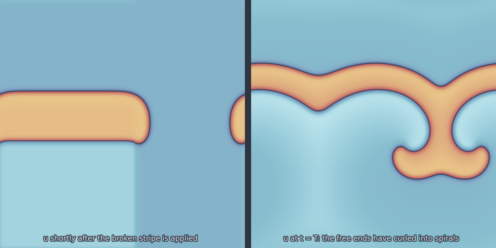

# FitzHugh-Nagumo 2D (`fitzhugh_nagumo_2d`)

Excitable media on the square, where the extra dimension buys a phenomenon the
line cannot host: a wavefront can break, and a broken front has free ends.
Whether those ends curl into rotating spirals or retract and die is decided by
the parameters, and the boundary between the two behaviours is sharp.

<figure class="pf-model-fig" markdown>

<figcaption>The broken stripe and, at t = T, the spiral its free end curls into (<code>fitzhugh_nagumo_2d</code>): the excitable recipe at beta = 0.5, on one colour scale.</figcaption>
</figure>

## Equation

$$\frac{\partial u}{\partial t} = D_u\,\nabla^2 u + u - u^3 - v$$

$$\frac{\partial v}{\partial t} = D_v\,\nabla^2 v + \epsilon\,(u - \gamma v + \beta)$$

with periodic boundary conditions.

## Operator learning task

$$u_0 \mapsto (u_T, v_T)$$

As in one dimension, the stored input is the activator field alone; both
components come back. To vary the inhibitor as well, build the model directly
and pass `ic_v` to `solve`, as in the spiral recipe below.

## Parameters

| Parameter | Default | Range | Description |
|-----------|---------|-------|-------------|
| `epsilon` | 0.08 | (0.01, 0.5) | Timescale separation; smaller gives sharper waves and spirals |
| `diffusivity_u` | 1.0 | (0.01, 10.0) | Activator diffusion, setting wave speed and pattern scale |
| `time_end` | 50.0 | (1.0, 200.0) | Final time |

## Excitability regimes

These were established numerically, and the test that pins them is
`tests/test_new_models.py::test_fhn_broken_front_regimes`.

At the default $\beta = 0.7$ the medium is **sub-excitable**: plane fronts
propagate, but a broken wavefront retracts from its free ends and dies, so no
spiral can form from a wave break. Around $\beta = 0.5$ with
$\epsilon \approx 0.02$ the medium is **fully excitable**: broken fronts curl at
the tips, collide and re-seed indefinitely. Excitation seeds must span roughly
8 units of $\sqrt{D_u}$ for a pulse to launch at all.

The site's motion loop uses the excitable recipe; the code is
`motion_fhn_spiral` in `scripts/make_gallery.py`.

## Usage

```python
from pdeforge import generate_dataset

dataset = generate_dataset(
    model="fitzhugh_nagumo_2d",
    n_samples=200,
    resolution={"x": 128, "y": 128},
    params={"epsilon": 0.08, "time_end": 50.0},
    seed=42,
)
```

!!! warning "The default measure mostly records decay"
    Two things work against excitation in the call above. The default
    $\beta = 0.7$ is sub-excitable, and when `solve` is given no `ic_v` it puts
    **every** point on the $v$-nullcline, including the stimulus, so there is no
    recovery lag for a pulse to exploit. A dataset generated this way is largely
    a dataset of decaying bumps. Set the medium to its rest state and stimulate
    from there, as below.

For the spiral regime, build the model directly so the initial condition can
carry a deliberate wave break:

```python
from pdeforge import get_model
import numpy as np

beta, gamma = 0.5, 0.8
u_rest = -0.76                       # most negative root of gamma u^3 + (1-gamma) u + beta
m = get_model("fitzhugh_nagumo_2d")(
    resolution={"x": 256, "y": 256},
    domain={"x": (0.0, 120.0), "y": (0.0, 120.0)},
    epsilon=0.02, beta=beta, time_end=400.0,
)
X, Y = np.meshgrid(m.grids["x"], m.grids["y"])
v_rest = (u_rest + beta) / gamma
u0 = np.full_like(X, u_rest)
v0 = np.full_like(X, v_rest)
u0[(np.abs(Y - 60.0) < 8.0) & (X < 66.0)] = 1.0    # a broken stripe
v0[(Y < 52.0) & (X < 66.0)] = v_rest + 0.45        # refractory block: the tips curl
traj = m.solve(u0, ic_v=v0, return_full=True)      # (n_t, ny, nx, 2)
```

Passing `ic_v` explicitly is what makes this work: it holds the medium at rest
so the stimulus sits above threshold rather than on the nullcline. The figure
at the top of this page is `traj[2]` against `traj[-1]`, and
`scripts/make_model_figures.py` regenerates it.

## Data shapes

```python
dataset.inputs.shape   # (n_samples, ny, nx)      u0
dataset.outputs.shape  # (n_samples, ny, nx, 2)   u_T, v_T on a trailing axis
```

Note that the component axis is trailing here, unlike the leading axis used by
[`gray_scott_2d`](gray_scott_2d.md) and [`burgers_2d`](burgers_2d.md).

## Related

- [`fitzhugh_nagumo_1d`](fitzhugh_nagumo_1d.md): the same system where fronts
  cannot break.
- [`gray_scott_2d`](gray_scott_2d.md): stationary patterns rather than
  travelling waves.
- [`allen_cahn_2d`](allen_cahn_2d.md): the cubic nonlinearity without an
  inhibitor.
