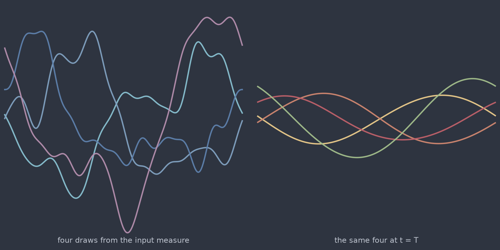

# Heat 1D (`heat_1d`)

Diffusion is the one operator whose behaviour you can predict before you run
anything: every Fourier mode decays at its own rate $e^{-\alpha k^2 T}$, so
high wavenumbers vanish first and the solution map is a low-pass filter with a
known cutoff. That makes `heat_1d` the baseline every other time-dependent
model in the catalogue is read against. If a network cannot learn this map, the
problem is the network.

<figure class="pf-model-fig" markdown>

<figcaption>Four draws from the input measure and their images at t = T (<code>heat_1d</code>): the operator strips high wavenumbers and leaves the slowest modes standing.</figcaption>
</figure>

## Equation

$$\frac{\partial u}{\partial t} = \alpha \frac{\partial^2 u}{\partial x^2}$$

with periodic boundary conditions on $[0, 2\pi]$.

## Operator learning task

$$u(x, 0) \mapsto u(x, T)$$

## Parameters

| Parameter | Default | Range | Description |
|-----------|---------|-------|-------------|
| `diffusivity` | 0.01 | (1e-6, 1.0) | Thermal diffusivity $\alpha$ |
| `time_end` | 1.0 | (0.01, 10.0) | Final time $T$ |

Only the product $\alpha T$ matters: doubling the diffusivity and halving the
horizon gives the same operator. Pick whichever of the two reads better in the
experiment you are describing.

## Usage

```python
from pdeforge import generate_dataset

dataset = generate_dataset(
    model="heat_1d",
    n_samples=1000,
    resolution={"x": 256},
    params={"diffusivity": 0.01, "time_end": 1.0},
    seed=42,
)
```

## Solver

The linear symbol $-\alpha k^2$ is applied exactly in Fourier space, so there
is no time-stepping error at all: the discrete solution is the exact solution
of the discrete problem, to machine precision. `time_end` therefore costs
nothing, and a horizon of 10 is as cheap as a horizon of 0.01.

## Behaviour

At $\alpha T \gtrsim 0.1$ on the $2\pi$ box, everything above $k \approx 3$ has
decayed by more than a factor of $e$, and the target fields become close to
low-order trigonometric polynomials. Datasets generated there are easy to the
point of being uninformative: an operator can score well by learning to output
the first few modes. For a benchmark with something left to resolve, keep
$\alpha T$ near 0.01.

## Data shapes

```python
dataset.inputs.shape   # (n_samples, nx)
dataset.outputs.shape  # (n_samples, nx)
```

## Related

- [`heat_2d`](heat_2d.md) and [`heat_3d`](heat_3d.md): the same solver on the
  square and the cube.
- [`stochastic_heat_1d`](stochastic_heat_1d.md): the same equation driven by
  space-time noise, which is where the uncertainty work starts.
- [`advection_1d`](advection_1d.md): the other exactly-propagated linear model,
  and the one that tests phase rather than amplitude.
