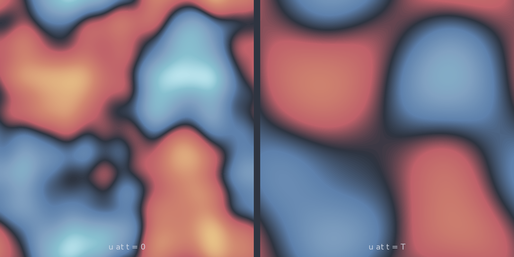

# Heat 2D (`heat_2d`)

Isotropic diffusion on the square. The map is the same low-pass filter as in
one dimension, now with the decay rate set by $|\mathbf{k}|^2 = k_x^2 + k_y^2$,
which means the corner modes of the spectrum die far faster than the axis
modes. Structures shrink into blobs, and the blobs merge.

<figure class="pf-model-fig" markdown>

<figcaption>The same field at t = 0 and t = T on one colour scale (<code>heat_2d</code>): fine texture goes first, the large-scale pattern survives.</figcaption>
</figure>

## Equation

$$\frac{\partial u}{\partial t} = \alpha \nabla^2 u
= \alpha\left(\frac{\partial^2 u}{\partial x^2} + \frac{\partial^2 u}{\partial y^2}\right)$$

with periodic boundary conditions.

## Operator learning task

$$u(x, y, 0) \mapsto u(x, y, T)$$

## Parameters

| Parameter | Default | Range | Description |
|-----------|---------|-------|-------------|
| `diffusivity` | 0.01 | (1e-6, 1.0) | Thermal diffusivity $\alpha$ |
| `time_end` | 1.0 | (0.01, 10.0) | Final time $T$ |

## Usage

```python
from pdeforge import generate_dataset

dataset = generate_dataset(
    model="heat_2d",
    n_samples=1000,
    resolution={"x": 64, "y": 64},
    params={"diffusivity": 0.01, "time_end": 1.0},
    seed=42,
)
```

## Solver

Exact spectral propagation, as in one dimension: `fftn` over both axes, the
symbol $e^{-\alpha |\mathbf{k}|^2 t}$ applied once, one inverse transform. A
sample costs two FFTs regardless of the horizon.

## Behaviour

The useful regime for a benchmark is the one where the output still carries
structure the input does not trivially predict. Solving
$e^{-\alpha T |\mathbf{k}|^2} = 0.01$ at the default $\alpha T = 0.01$ puts the
1%-of-amplitude cutoff at $|\mathbf{k}| \approx 21$, which at $64^2$ leaves
most of the resolvable spectrum alive. Raising $\alpha T$ to 0.1 drops that
cutoff to $|\mathbf{k}| \approx 7$, and the target starts to look like a handful
of modes.

## Data shapes

```python
dataset.inputs.shape   # (n_samples, ny, nx)
dataset.outputs.shape  # (n_samples, ny, nx)
```

## Related

- [`heat_1d`](heat_1d.md), [`heat_3d`](heat_3d.md): the same model in one and
  three dimensions.
- [`stochastic_heat_2d`](stochastic_heat_2d.md): forced by space-time noise,
  with an ensemble per initial condition.
- [`allen_cahn_2d`](allen_cahn_2d.md): diffusion plus a double-well reaction,
  which stops the smoothing and holds interfaces instead.
