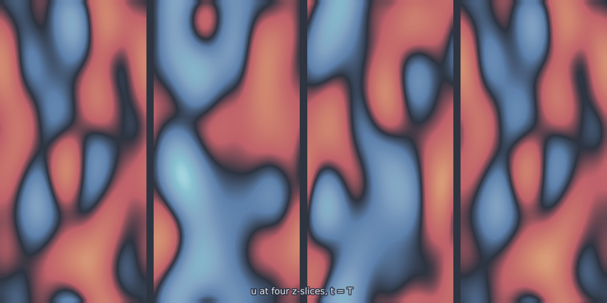

# Heat 3D (`heat_3d`)

The three-dimensional twin of [`heat_1d`](heat_1d.md) and
[`heat_2d`](heat_2d.md), and the model to reach for when the question is
whether an architecture survives a volumetric field at all. The physics holds
no surprises; the memory does.

<figure class="pf-model-fig" markdown>

<figcaption>Four evenly spaced z-slices of u at t = T (<code>heat_3d</code>): the diffused field on the periodic cube.</figcaption>
</figure>

## Equation

$$\frac{\partial u}{\partial t} = \alpha \nabla^2 u$$

on the periodic cube.

## Operator learning task

$$u(x, y, z, 0) \mapsto u(x, y, z, T)$$

## Parameters

| Parameter | Default | Range | Description |
|-----------|---------|-------|-------------|
| `diffusivity` | 0.01 | (1e-6, 1.0) | Thermal diffusivity $\alpha$ |
| `time_end` | 1.0 | (0.01, 10.0) | Final time $T$ |

## Usage

```python
from pdeforge import generate_dataset

dataset = generate_dataset(
    model="heat_3d",
    n_samples=200,
    resolution={"x": 64, "y": 64, "z": 64},
    params={"diffusivity": 0.01, "time_end": 1.0},
    seed=42,
    to="heat3d.h5",     # write straight to disk, chunked
)
```

## Solver

The spectral seam is dimension-agnostic: it runs `fftn` over however many
spatial axes the `resolution` dict declares, so this is `heat_1d`'s code path
with one more axis. Propagation stays exact.

!!! warning "Mind the memory"
    A single $64^3$ field in float64 is 2 MB, so inputs and outputs together
    come to 4 MB per sample: a 1000-sample set is 4 GB in RAM if you ask for it
    all at once. Pass `to=` to stream chunks to disk, which is what the
    `chunk_size` argument exists for.

## Data shapes

```python
dataset.inputs.shape   # (n_samples, nz, ny, nx)
dataset.outputs.shape  # (n_samples, nz, ny, nx)
```

## Related

- [`allen_cahn_3d`](allen_cahn_3d.md) and [`cahn_hilliard`](cahn_hilliard.md):
  the other volumetric models, both with real 3D structure to resolve.
- [`darcy_fno_3d`](darcy_fno_3d.md): the steady elliptic problem on the cube.
