# Models

PDEForge ships **41 models**. Each one has its own page below, with the
equation it solves, the operator-learning task it defines, its parameters and
their ranges, a runnable snippet, and a figure generated by the package
itself.

Most models run on the base installation. Eight need FEniCSx, which is marked
in the tables and covered in [FEniCSx setup](../getting-started/fenicsx.md);
`airfoil_euler_2d` is finite-volume and pure NumPy.

Published benchmark setups ship as **presets** rather than as separate models,
so the coefficients, the domain and the input measure travel together. See the
[preset list](../guide/models.md#presets).

---

## Diffusion and transport

Linear and near-linear baselines. Everything here is cheap, and the answers
are predictable enough to make these the models you debug a pipeline against.

| Model | Task | Backend |
|---|---|---|
| [`heat_1d`](heat_1d.md) | $u(x,0) \mapsto u(x,T)$ | spectral |
| [`heat_2d`](heat_2d.md) | $u(x,y,0) \mapsto u(x,y,T)$ | spectral |
| [`heat_3d`](heat_3d.md) | $u(\mathbf{x},0) \mapsto u(\mathbf{x},T)$ on the cube | spectral |
| [`advection_1d`](advection_1d.md) | exact translation; the sanity anchor | spectral |
| [`darcy_2d`](darcy_2d.md) | $\kappa \mapsto u$, periodic | spectral |

<div class="pf-model-grid" markdown>
<figure markdown>

<figcaption>[`heat_1d`](heat_1d.md): four inputs and their images at T</figcaption>
</figure>
<figure markdown>

<figcaption>[`advection_1d`](advection_1d.md): translation, shape intact</figcaption>
</figure>
<figure markdown>

<figcaption>[`darcy_2d`](darcy_2d.md): pressure over a heterogeneous medium</figcaption>
</figure>
</div>

## Waves and dispersion

Non-dissipative dynamics, where nothing is smoothed away and a low-pass bias
in an operator shows up immediately.

| Model | Task | Backend |
|---|---|---|
| [`wave_1d`](wave_1d.md) | $u(x,0) \mapsto u(x,T)$ | spectral |
| [`wave_2d`](wave_2d.md) | $u(x,y,0) \mapsto u(x,y,T)$ | spectral |
| [`heterogeneous_wave_2d`](heterogeneous_wave_2d.md) | medium $c \mapsto$ wavefield | spectral |
| [`helmholtz_2d`](helmholtz_2d.md) | source $f \mapsto$ field, frequency domain | spectral |
| [`kdv_1d`](kdv_1d.md) | solitons and undular bores; four presets | spectral |
| [`schrodinger_1d`](schrodinger_1d.md) | complex field, norm conserved exactly | spectral |

<div class="pf-model-grid" markdown>
<figure markdown>
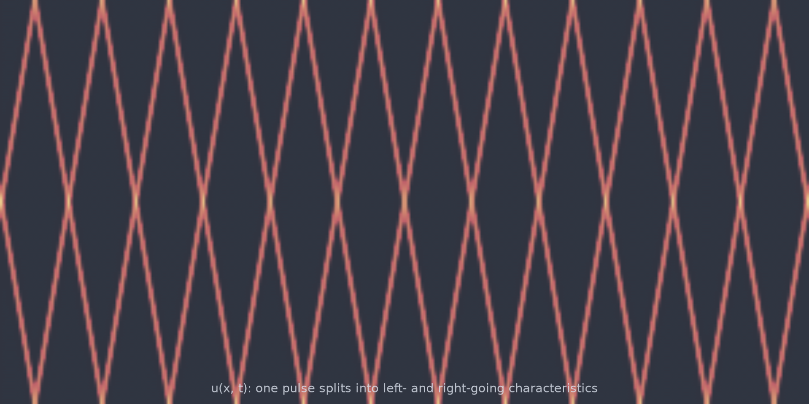
<figcaption>[`wave_1d`](wave_1d.md): one pulse splits into two characteristics</figcaption>
</figure>
<figure markdown>

<figcaption>[`kdv_1d`](kdv_1d.md): solitons overtake and survive</figcaption>
</figure>
<figure markdown>

<figcaption>[`heterogeneous_wave_2d`](heterogeneous_wave_2d.md): refraction through a random medium</figcaption>
</figure>
<figure markdown>
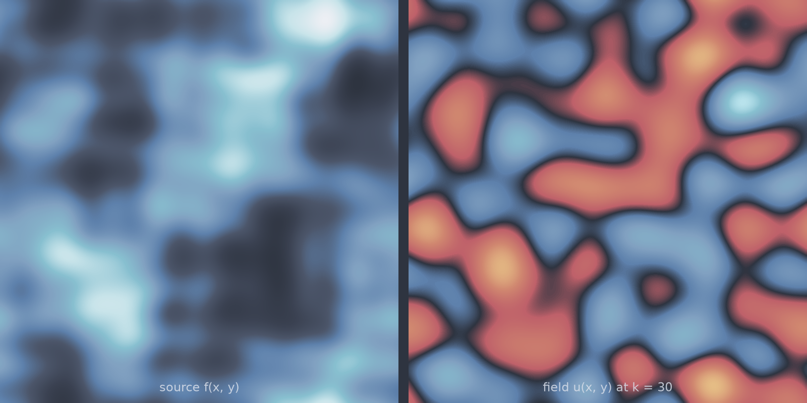
<figcaption>[`helmholtz_2d`](helmholtz_2d.md): a smooth, sub-resonant source and its field</figcaption>
</figure>
<figure markdown>

<figcaption>[`schrodinger_1d`](schrodinger_1d.md): a focusing condensate</figcaption>
</figure>
<figure markdown>
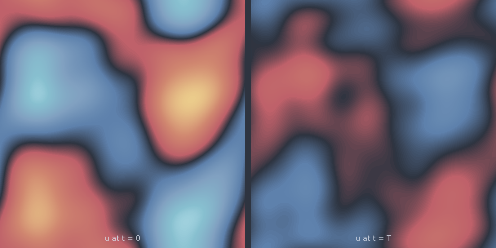
<figcaption>[`wave_2d`](wave_2d.md): amplitude conserved, pattern rearranged</figcaption>
</figure>
</div>

## Nonlinear advection and turbulence

Where the difficulty concentrates: shocks, filaments and chaos.

| Model | Task | Backend |
|---|---|---|
| [`burgers_1d`](burgers_1d.md) | shock formation; six presets | spectral |
| [`burgers_2d`](burgers_2d.md) | vector self-advection, no pressure | spectral |
| [`ks_1d`](ks_1d.md) | spatiotemporal chaos | spectral |
| [`ns_vorticity_2d`](ns_vorticity_2d.md) | the canonical FNO benchmark | spectral / JAX |
| [`kolmogorov_flow_2d`](kolmogorov_flow_2d.md) | forced, statistically steady turbulence | spectral / JAX |
| [`shallow_water_2d`](shallow_water_2d.md) | three coupled fields, mass conserved exactly | spectral |

<div class="pf-model-grid" markdown>
<figure markdown>

<figcaption>[`burgers_1d`](burgers_1d.md): steepening until viscosity holds the front</figcaption>
</figure>
<figure markdown>

<figcaption>[`ks_1d`](ks_1d.md): chaos in space and time</figcaption>
</figure>
<figure markdown>

<figcaption>[`kolmogorov_flow_2d`](kolmogorov_flow_2d.md): forced 2D turbulence</figcaption>
</figure>
<figure markdown>
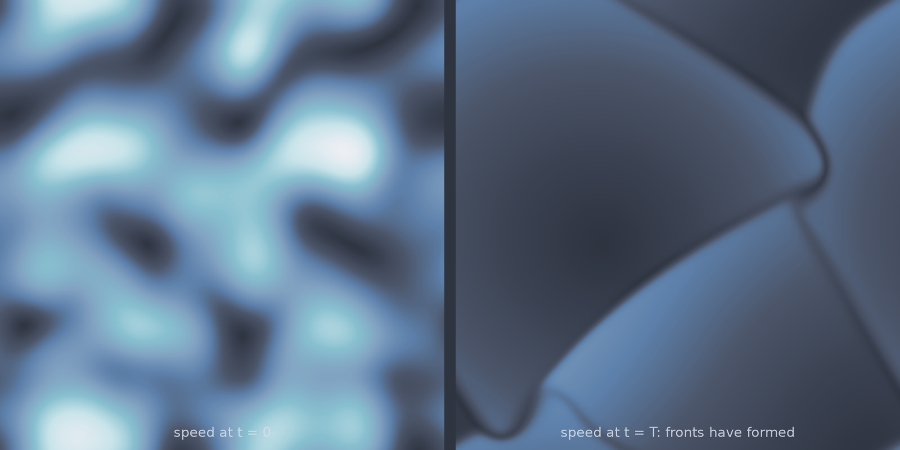
<figcaption>[`burgers_2d`](burgers_2d.md): fronts in two dimensions</figcaption>
</figure>
<figure markdown>
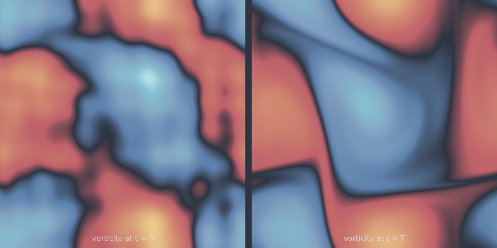
<figcaption>[`ns_vorticity_2d`](ns_vorticity_2d.md): patches merge and shear into sheets</figcaption>
</figure>
<figure markdown>
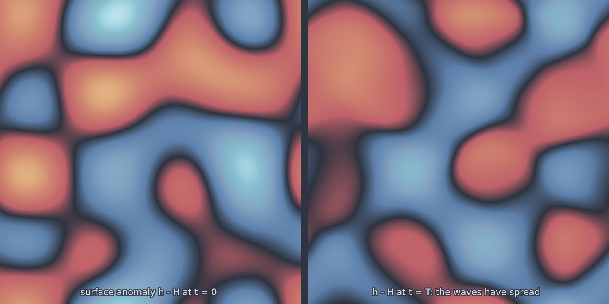
<figcaption>[`shallow_water_2d`](shallow_water_2d.md): gravity waves spreading</figcaption>
</figure>
</div>

## Pattern formation and phase separation

Models whose output structure is generated by the dynamics rather than
supplied in the input.

| Model | Task | Backend |
|---|---|---|
| [`allen_cahn_1d`](allen_cahn_1d.md) | interfaces annihilating in pairs | spectral |
| [`allen_cahn_2d`](allen_cahn_2d.md) | curvature-driven coarsening | spectral |
| [`allen_cahn_3d`](allen_cahn_3d.md) | the same on the cube | spectral |
| [`cahn_hilliard`](cahn_hilliard.md) | spinodal decomposition, 2D or 3D, mean conserved | spectral |
| [`gray_scott_2d`](gray_scott_2d.md) | the Pearson parameter plane | spectral / JAX |
| [`fitzhugh_nagumo_1d`](fitzhugh_nagumo_1d.md) | excitable pulses past a threshold | spectral |
| [`fitzhugh_nagumo_2d`](fitzhugh_nagumo_2d.md) | broken fronts, spirals, and when they die | spectral |
| [`lotka_volterra_2d`](lotka_volterra_2d.md) | predator-prey with diffusion | spectral |

<div class="pf-model-grid" markdown>
<figure markdown>

<figcaption>[`allen_cahn_1d`](allen_cahn_1d.md): interfaces drift together and annihilate</figcaption>
</figure>
<figure markdown>

<figcaption>[`cahn_hilliard`](cahn_hilliard.md): the spinodal interface in 3D</figcaption>
</figure>
<figure markdown>

<figcaption>[`gray_scott_2d`](gray_scott_2d.md): every (feed, kill) pair grows a different pattern</figcaption>
</figure>
<figure markdown>
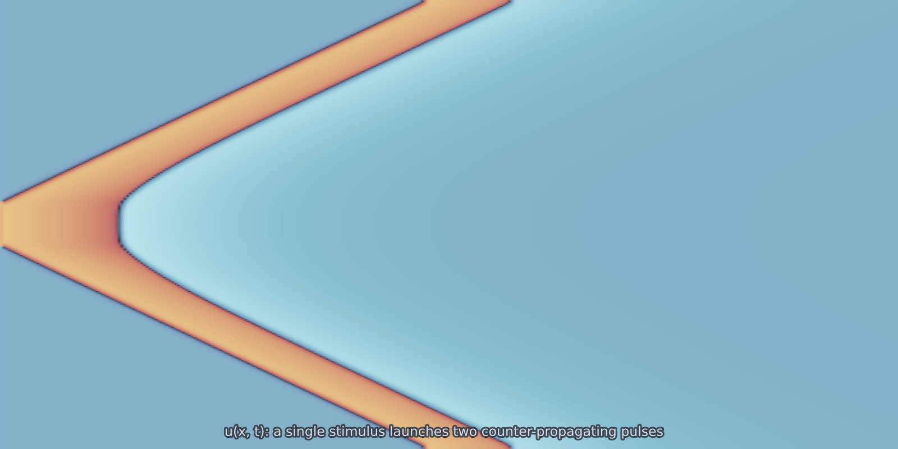
<figcaption>[`fitzhugh_nagumo_1d`](fitzhugh_nagumo_1d.md): one stimulus, two pulses</figcaption>
</figure>
<figure markdown>
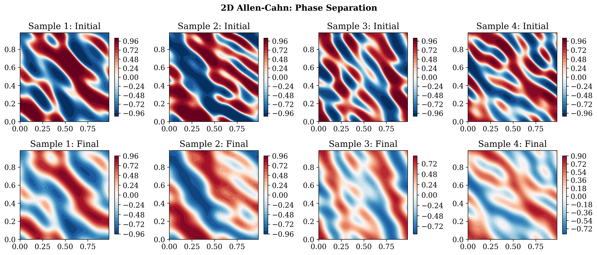
<figcaption>[`allen_cahn_2d`](allen_cahn_2d.md): domains separated by thin interfaces</figcaption>
</figure>
<figure markdown>

<figcaption>[`lotka_volterra_2d`](lotka_volterra_2d.md): predator trails prey</figcaption>
</figure>
</div>

## Porous media and solids

Coefficient-to-solution maps, which is the shape most inverse problems take.

| Model | Task | Backend |
|---|---|---|
| [`darcy_fno_2d`](darcy_fno_2d.md) | the canonical benchmark, bit-exact | direct sparse |
| [`darcy_fno_3d`](darcy_fno_3d.md) | the same measure on the cube; no frozen dataset exists | direct / CG |
| [`elasticity_2d`](elasticity_2d.md) | modulus $\mapsto$ displacement and stress | **FEniCSx** |
| [`porous_darcy_fem`](porous_darcy_fem.md) | flow through a grown microstructure | **FEniCSx** |

<div class="pf-model-grid" markdown>
<figure markdown>
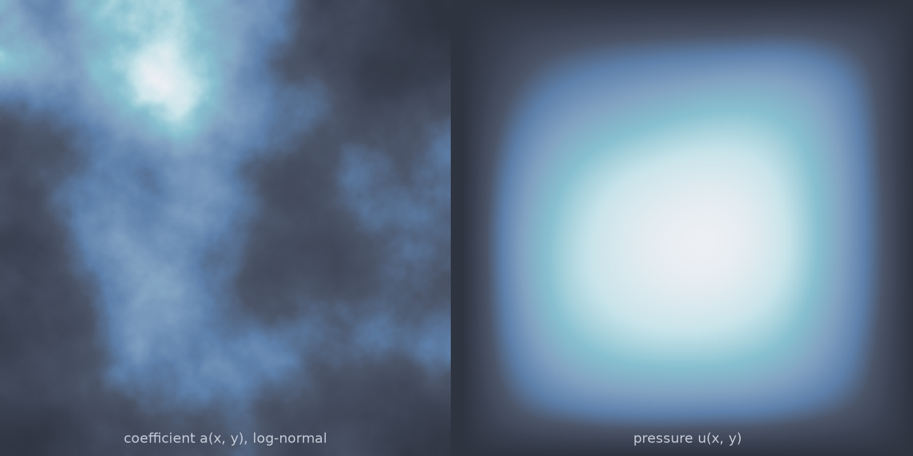
<figcaption>[`darcy_fno_2d`](darcy_fno_2d.md): coefficient and the pressure it induces</figcaption>
</figure>
<figure markdown>

<figcaption>[`darcy_fno_3d`](darcy_fno_3d.md): pressure isosurfaces on the cube</figcaption>
</figure>
<figure markdown>
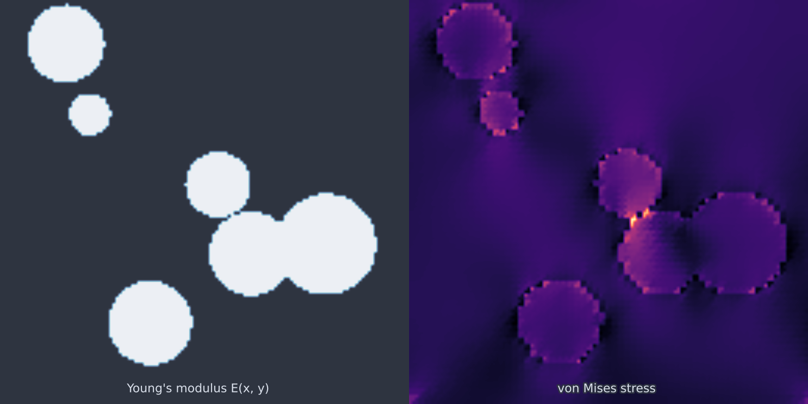
<figcaption>[`elasticity_2d`](elasticity_2d.md): stress concentrating at stiff inclusions</figcaption>
</figure>
</div>

## Viscous and compressible flow

Walls, obstacles and geometry. Everything here except `stokes_2d` and
`airfoil_euler_2d` needs FEniCSx.

| Model | Task | Backend |
|---|---|---|
| [`stokes_2d`](stokes_2d.md) | force $\mapsto$ velocity and pressure, creeping flow | spectral |
| [`cylinder_flow_2d`](cylinder_flow_2d.md) | steady wake behind a cylinder | **FEniCSx** |
| [`cylinder_flow_2d_unsteady`](cylinder_flow_2d_unsteady.md) | the von Kármán vortex street, as a trajectory | **FEniCSx** |
| [`cylinder_flow_2d_parameterized`](cylinder_flow_2d_parameterized.md) | cylinder position as an input | **FEniCSx** |
| [`cylinder_flow_2d_turbulent`](cylinder_flow_2d_turbulent.md) | Re 2000 under a Smagorinsky closure | **FEniCSx** |
| [`naca_flow_2d`](naca_flow_2d.md) | airfoil geometry $\mapsto$ laminar flow, with $C_l$ and $C_d$ | **FEniCSx** |
| [`rayleigh_benard_2d`](rayleigh_benard_2d.md) | convection in a closed cavity, Nusselt-validated | **FEniCSx** |
| [`airfoil_euler_2d`](airfoil_euler_2d.md) | transonic Euler with a shock, on a C-grid | finite volume |

<div class="pf-model-grid" markdown>
<figure markdown>
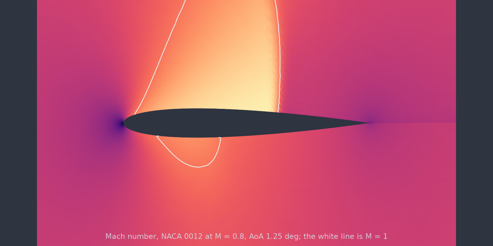
<figcaption>[`airfoil_euler_2d`](airfoil_euler_2d.md): the supersonic pocket and its shock</figcaption>
</figure>
<figure markdown>

<figcaption>[`naca_flow_2d`](naca_flow_2d.md): laminar flow past a drawn airfoil</figcaption>
</figure>
<figure markdown>

<figcaption>[`cylinder_flow_2d_unsteady`](cylinder_flow_2d_unsteady.md): the vortex street</figcaption>
</figure>
<figure markdown>

<figcaption>[`stokes_2d`](stokes_2d.md): forcing and the flow it drives</figcaption>
</figure>
<figure markdown>
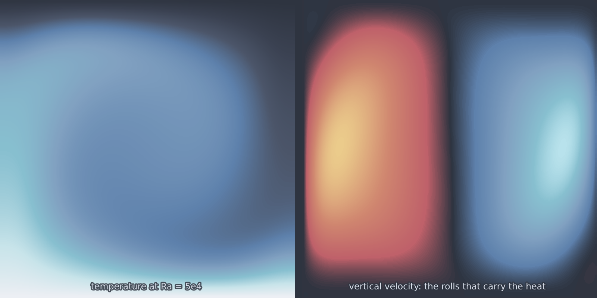
<figcaption>[`rayleigh_benard_2d`](rayleigh_benard_2d.md): convection rolls in the cavity</figcaption>
</figure>
<figure markdown>

<figcaption>[`porous_darcy_fem`](porous_darcy_fem.md): flow through a grown labyrinth</figcaption>
</figure>
</div>

## Stochastic PDEs

Each sample carries several realisations of the same solve, so the target is a
distribution. This is the part of the catalogue the
[calibration protocol](../guide/calibration.md) exists for.

| Model | Task | Backend |
|---|---|---|
| [`stochastic_heat_1d`](stochastic_heat_1d.md) | Gaussian, analytically known covariance | spectral |
| [`stochastic_heat_2d`](stochastic_heat_2d.md) | the same on the square | spectral |
| [`stochastic_burgers_1d`](stochastic_burgers_1d.md) | spread concentrated at the fronts | spectral |
| [`stochastic_allen_cahn_2d`](stochastic_allen_cahn_2d.md) | multimodal: realisations branch between wells | spectral |

<div class="pf-model-grid" markdown>
<figure markdown>

<figcaption>[`stochastic_heat_1d`](stochastic_heat_1d.md): one input, an ensemble out</figcaption>
</figure>
<figure markdown>
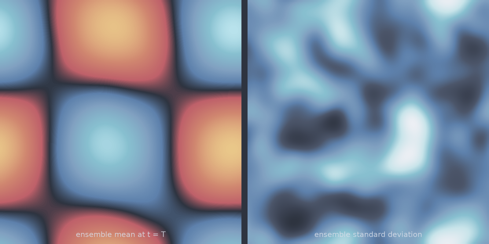
<figcaption>[`stochastic_heat_2d`](stochastic_heat_2d.md): ensemble mean and spread</figcaption>
</figure>
<figure markdown>
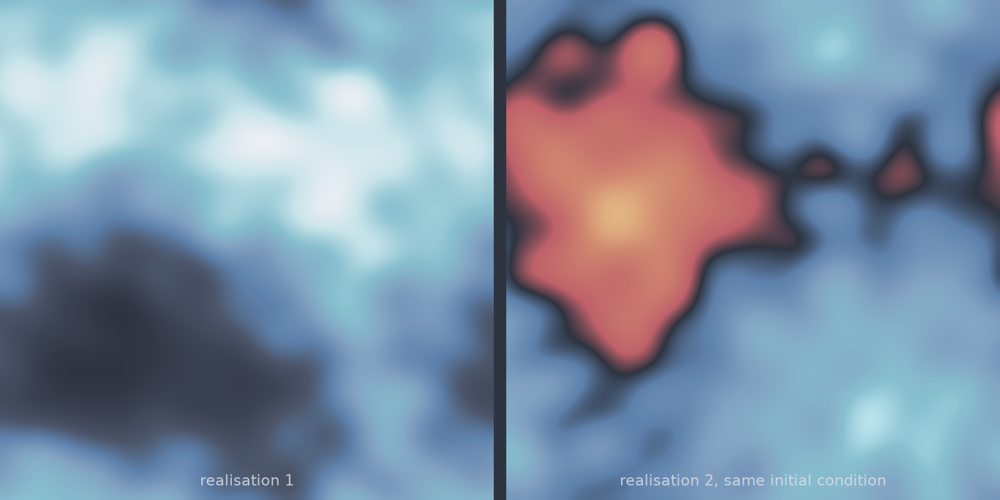
<figcaption>[`stochastic_allen_cahn_2d`](stochastic_allen_cahn_2d.md): two realisations, one input</figcaption>
</figure>
</div>

---

## Finding a model from code

```python
from pdeforge import list_models, describe_model

list_models()                    # every registered name
print(describe_model("kdv_1d"))  # parameters, ranges, field names, backend
```

Every figure on this page is package output, seeded and regenerable:
`scripts/make_model_figures.py` builds the per-model set and
`scripts/make_gallery.py` builds the [gallery](../gallery.md).
