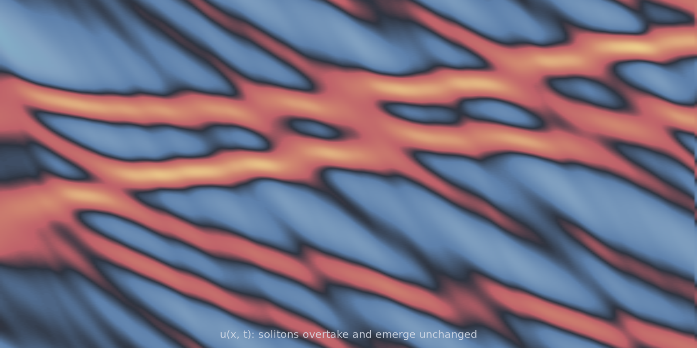

# KdV 1D (`kdv_1d`)

One model, one solver, several regimes. The Korteweg-de Vries equation is the
canonical dispersive PDE: $\text{sech}^2$ solitary waves travel at a speed set
by their own amplitude and pass through each other unchanged. The published
KdV setups in the operator-learning literature differ only in their
coefficients, box size and input measure, so they ship here as **presets** on
one model instead of as separate models.

<figure class="pf-model-fig" markdown>

<figcaption>Space-time diagram of u(x, t) (<code>kdv_1d</code>): solitons of different amplitudes cross repeatedly and re-emerge with their shapes intact.</figcaption>
</figure>

## Equation

$$\frac{\partial u}{\partial t}
+ \mu\, u \frac{\partial u}{\partial x}
+ \delta^2 \frac{\partial^3 u}{\partial x^3} = 0$$

on a periodic box. Defaults are the textbook normalisation: $\mu = 6$,
$\delta^2 = 1$ on $[0, 20]$, with a soliton input measure.

## Operator learning task

$$u(x, 0) \mapsto u(x, T)$$

or the whole trajectory with `outputs="trajectory"`.

## Parameters

| Parameter | Default | Range | Description |
|-----------|---------|-------|-------------|
| `time_end` | 1.0 | (0.01, 200.0) | Final time $T$ |
| `advection` | 6.0 | (0.1, 20.0) | Coefficient $\mu$ on $u u_x$; textbook KdV is 6 |
| `dispersion` | 1.0 | (1e-6, 10.0) | Coefficient $\delta^2$ on $u_{xxx}$ |
| `dealias` | `True` | | 2/3 rule on the nonlinear term |
| `scale_jitter` | 0.0 | | Per-trajectory randomisation of box and horizon |

## Presets

| Preset | Regime |
|---|---|
| *(model default)* | Solitons: $\mu=6$, $\delta^2=1$, $L=20$, elastic collisions |
| `kdv_dsw_1d` | Undular bore, $\delta^2 = 8\times10^{-6}$: un-resolvable bias set |
| `kdv_dsw_epistemic_1d` | Undular bore, $\delta^2 = 4\times10^{-5}$: near-resolvable |
| `mp_pde_kdv_1d` | Brandstetter et al. benchmark, $\mu=\delta^2=1$, $L=128$ |
| `mp_pde_kdv_easy_1d` | The same at $T = 50$ |

## Usage

```python
from pdeforge import generate_dataset

# textbook solitons
dataset = generate_dataset(
    model="kdv_1d",
    n_samples=1000,
    resolution={"x": 256},
    params={"advection": 6.0, "dispersion": 1.0, "time_end": 1.0},
    seed=42,
)

# a published regime, pinned
bore = generate_dataset(preset="kdv_dsw_1d", n_samples=1000, seed=0)
```

## Solver

The stiff dispersion term has symbol $i\,\delta^2 k^3$, which is integrated
exactly by ETDRK4: the stiffness that cripples explicit schemes never appears
in the time step, and only $\mu\,u u_x$ is stepped. That is what makes the
small-$\delta^2$ bore regimes affordable at all.

## Dispersive shock waves (`kdv_dsw_1d`, `kdv_dsw_epistemic_1d`)

A localised smooth **depression** (the `depression_box` input measure) does not
steepen into a thin front. Under KdV it dissolves into a **dispersive shock
wave**, an undular bore: sustained high-wavenumber oscillations filling a
large, contiguous region. Where a Burgers shock mis-samples only a
$\sqrt{\nu}$-thin front, the bore is hard for a band-limited operator
*everywhere it lives*, which makes it a stringent operator and UQ benchmark.

```python
dataset = generate_dataset(preset="kdv_dsw_1d", n_samples=1000, seed=0)
```

The two bore presets are a matched pair. At $n_x = 512$ the vigorous bore
($\delta^2 = 8\times10^{-6}$) shows about 155 oscillations but is *not* grid
converged: it has about 429 at $n_x = 2048$, so its hardness is a **bias**
floor no amount of data removes. The longer-wavelength bore
($4\times10^{-5}$) shows about 83 oscillations and is already converged at
$n_x = 512$, so its hardness is **epistemic**, meaning data-limited. That
contrast is what makes them useful together for method comparison.

!!! note "Spectral centroid will mislead you here"
    With dealiasing on, the 2/3 mask truncates the $8\times10^{-6}$ bore, so
    its spectral centroid reads *lower* (3.8) than the resolvable bore's
    (10.3) despite having the shorter wavelength. Count oscillations rather
    than centroid: the truncation is the phenomenon, and not an artefact to
    average over.

## The neural-emulator benchmark regime (`mp_pde_kdv_1d`)

Brandstetter et al. (*Message Passing Neural PDE Solvers*, arXiv:2202.03376;
*Lie Point Symmetry Data Augmentation*, arXiv:2202.07643) use
$\mu = \delta^2 = 1$ on a long $L = 128$ box. That whole setup ships as a
preset:

```python
dataset = generate_dataset(preset="mp_pde_kdv_1d", n_samples=512, seed=0)
# -> inputs (512, 256), outputs (512, 140, 256) trajectories
```

The preset pins the four things that make that regime what it is:

| Setting | Value | Why it matters |
|---|---|---|
| `advection`, `dispersion` | `1.0`, `1.0` | Not the textbook $\mu = 6$; a different soliton amplitude-speed law |
| `ic_generator="sine_series"` | 10 waves, $l \in \{1, 2\}$ | Long-wave random sine series (see below) |
| `scale_jitter` | `0.1` | Each trajectory draws its own $L$ and $T$ within $\pm 10\%$ |
| `_n_frames_kept` | `140` of `250` | Trajectories start at $t \approx 0.44\,T$, from a developed soliton gas |

**The input measure.** `sine_series` (`TruncatedSineGenerator`) draws

$$u_0(x) = \sum_{j=1}^{N} A_j \sin\!\left(2\pi l_j x / L + \phi_j\right)$$

with $A_j \sim U(-0.5, 0.5)$, $\phi_j \sim U(0, 2\pi)$, and integer $l_j$ from
the **half-open** range $[l_\min, l_\max)$. The canonical $(1, 3)$ therefore
excites modes 1 and 2, with mode 3 excluded by the half-open convention;
closing the interval would silently widen the measure. The field is exactly
zero-mean on a uniform periodic grid, which KdV then conserves.

**Scale jitter.** KdV's scaling symmetry
$(u, x, t) \mapsto (\lambda^2 u, x/\lambda, t/\lambda^3)$ is what makes a
randomised box worth having rather than a relabelling. Because this measure is
a function of $x/L$, jitter leaves the *initial conditions* untouched and
perturbs only the dynamics. Note that the dataset's stored grid stays
**nominal**: per-sample $dx$ and $dt$ differ from it by up to the jitter
fraction, so the genuinely shared coordinate is $x/L$. Jitter requires
`backend="numpy"`.

**Dealiasing.** The preset sets `dealias=False` to match the reference
generator's `psdiff` right-hand side. This is not fidelity theatre: at
$n_x = 256$ the 2/3 mask also removes *genuine* spectral content once KdV has
broadened the spectrum. Measured against a converged $n_x = 1024$ reference at
$T = 100$, un-dealiased ETDRK4 sits at $8 \times 10^{-7}$ relative $L^2$,
dealiased at $1 \times 10^{-4}$, and the reference generator's own
Radau plus `psdiff` scheme at $2.9 \times 10^{-4}$. `_dt = 5e-3` is converged
there.

## Data shapes

```python
dataset.inputs.shape   # (n_samples, nx)
dataset.outputs.shape  # (n_samples, nx)  or (n_samples, n_t, nx) for trajectories
```

## Related

- [`burgers_1d`](burgers_1d.md): the same nonlinearity with diffusion instead
  of dispersion, and a thin shock instead of a bore.
- [`schrodinger_1d`](schrodinger_1d.md): the other dispersive 1D model.
- [`ks_1d`](ks_1d.md): the chaotic member of the family.
