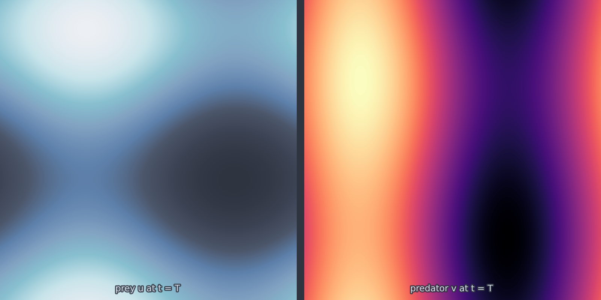

# Lotka-Volterra 2D (`lotka_volterra_2d`)

The predator-prey oscillation with diffusion added. Without space, the classic
system cycles forever on a closed orbit; add diffusion and the cycles at
different points fall out of phase, so the oscillation turns into travelling
population waves and patchy dynamics. The spatially uniform case reduces
exactly to the textbook ordinary differential equations, and that reduction is
used as the model's validation invariant.

<figure class="pf-model-fig" markdown>

<figcaption>Prey and predator densities at t = T (<code>lotka_volterra_2d</code>): the predator field trails the prey field it feeds on.</figcaption>
</figure>

## Equation

$$\frac{\partial u}{\partial t} = D_u \nabla^2 u + a\,u - b\,u v
\qquad \text{(prey)}$$

$$\frac{\partial v}{\partial t} = D_v \nabla^2 v - c\,v + d\,u v
\qquad \text{(predator)}$$

on the periodic box.

## Operator learning task

$$(u, v)(x, y, 0) \mapsto (u, v)(x, y, T)$$

with components stacked on a leading axis, shape `(2, ny, nx)`.

## Parameters

| Parameter | Default | Range | Description |
|-----------|---------|-------|-------------|
| `a` | 1.0 | (0.0, 10.0) | Prey growth rate |
| `b` | 1.0 | (0.0, 10.0) | Predation rate |
| `c` | 1.0 | (0.0, 10.0) | Predator death rate |
| `d` | 1.0 | (0.0, 10.0) | Predator growth per prey |
| `Du` | 0.01 | (0.0, 1.0) | Prey diffusivity |
| `Dv` | 0.005 | (0.0, 1.0) | Predator diffusivity |
| `time_end` | 5.0 | (0.1, 100.0) | Final time |

The coexistence fixed point sits at $(u, v) = (c/d,\; a/b)$, which is
$(1, 1)$ at the defaults. Initial fields far from it produce large excursions
and correspondingly large dynamic range in the target.

## Usage

```python
from pdeforge import generate_dataset

dataset = generate_dataset(
    model="lotka_volterra_2d",
    n_samples=500,
    resolution={"x": 128, "y": 128},
    params={"a": 1.0, "b": 1.0, "c": 1.0, "d": 1.0, "time_end": 5.0},
    seed=42,
)
```

## Solver

The diagonal linear parts, meaning diffusion together with the linear growth
and decay terms, ride in the exactly integrated operator; the $uv$ coupling is
stepped explicitly.

## Behaviour

The unequal diffusivities matter: at the defaults the prey spreads twice as
fast as the predator, so predator patches lag behind prey patches and the two
fields are visibly offset in space. Setting $D_u = D_v$ removes that offset
and gives a far more predictable target.

Because the underlying kinetics is conservative rather than damped, there is no
attractor to relax onto and long horizons keep producing new configurations.

## Data shapes

```python
dataset.inputs.shape   # (n_samples, 2, ny, nx)
dataset.outputs.shape  # (n_samples, 2, ny, nx)
```

## Related

- [`gray_scott_2d`](gray_scott_2d.md): reaction-diffusion where the kinetics
  select a stationary pattern.
- [`fitzhugh_nagumo_2d`](fitzhugh_nagumo_2d.md): two components with a
  threshold rather than a cycle.
