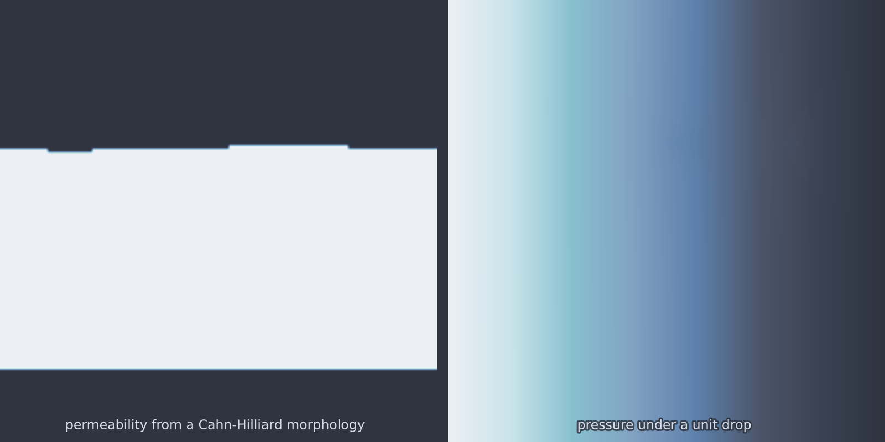

# Porous Darcy FEM (`porous_darcy_fem`)

The cross-model pipeline, and the answer to a practical complaint about
porous-media datasets: they are usually built by re-slicing one frozen
micro-CT image, so the geometry has no knobs and no independent samples. Here
a seeded [`cahn_hilliard`](cahn_hilliard.md) run *grows* a spinodal
morphology, thresholding turns it into a two-phase permeability field, and
steady Darcy flow is driven across it. Every seed gives a fresh labyrinth, at
any resolution.

<figure class="pf-model-fig" markdown>

<figcaption>A Cahn-Hilliard permeability field and the pressure across it under a unit drop (<code>porous_darcy_fem</code>).</figcaption>
</figure>

## Equation

$$-\nabla \cdot \big(k(\mathbf{x})\,\nabla p\big) = 0,
\qquad p = 1 \text{ at } x_{\min},
\qquad p = 0 \text{ at } x_{\max},$$

with no-flux side walls, and Darcy velocity $\mathbf{u} = -k\,\nabla p$.

## Operator learning task

$$k(x, y) \mapsto (p,\ u_x,\ u_y)$$

## Parameters

| Parameter | Default | Range | Description |
|-----------|---------|-------|-------------|
| `permeability_contrast` | 1e3 | (10, 1e6) | $k_{\text{pore}} / k_{\text{solid}}$ |
| `ch_time` | 8.0 | (1.0, 100.0) | Cahn-Hilliard coarsening time of the morphology |

`ch_time` selects the stage of the microstructure: early gives a fine spinodal
maze, late gives coarse domains. It is a geometry knob dressed as a time,
which is exactly what a frozen image cannot offer.

Raising `permeability_contrast` confines the flow more tightly to the pore
labyrinth and makes the problem stiffer, since the coefficient jump across
each interface grows with it.

## Usage

```python
from pdeforge import generate_dataset

dataset = generate_dataset(
    model="porous_darcy_fem",
    n_samples=100,
    resolution={"x": 64, "y": 64},
    params={"ch_time": 8.0, "permeability_contrast": 1e3},
    seed=42,
)
```

The effective permeability $k_{\text{eff}} = Q/\Delta p$ is computed on every
solve and returned in that sample's validation record, together with the
inflow and outflow used to check the balance.

This model needs FEniCSx. See [FEniCSx setup](../getting-started/fenicsx.md).

## Validation

Two checks. Global flux balance compares inflow against outflow across the
two pressure boundaries, and the maximum principle for $p$ requires the
pressure to stay within its boundary values everywhere. The effective
permeability $k_{\text{eff}} = Q / \Delta p$ is stored per sample, which also
gives a scalar summary to compare across morphologies.

## Behaviour

Flow through a high-contrast labyrinth is dominated by a small number of
percolating paths, and most of the pore space carries almost nothing. That
concentration is the interesting part of the target and the part an averaged
metric will not see, since the paths occupy a small fraction of the domain.

## Data shapes

```python
dataset.inputs.shape   # (n_samples, nx, ny)      k
dataset.outputs.shape  # (n_samples, nx, ny, 3)   p, ux, uy
```

The FEniCSx models store space as `(nx, ny)` with the component axis trailing,
transposed relative to the spectral models' `(ny, nx)`.

## Related

- [`cahn_hilliard`](cahn_hilliard.md): the model that grows the geometry.
- [`darcy_fno_2d`](darcy_fno_2d.md): the same physics on a smooth log-normal
  coefficient rather than a two-phase microstructure.
- [`elasticity_2d`](elasticity_2d.md): the other heterogeneous-medium FEniCSx
  model.
