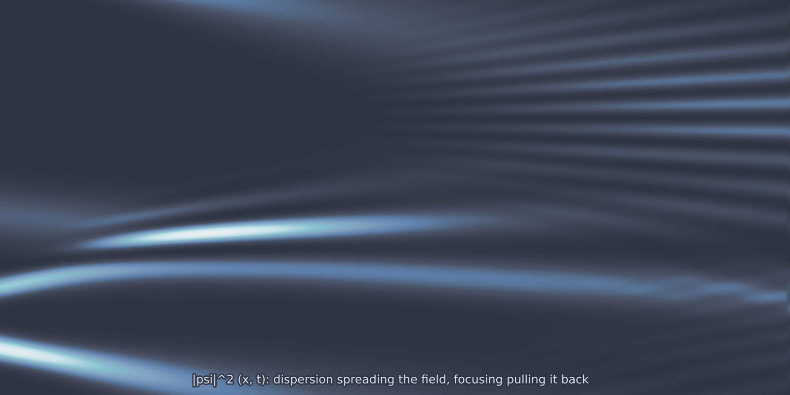

# Schrödinger 1D (`schrodinger_1d`)

The nonlinear Schrödinger equation, and the only complex-valued model in the
catalogue. Two properties make it worth having: the dynamics are dispersive
rather than dissipative, so nothing is smoothed away, and the solver conserves
the $L^2$ norm to machine precision, which gives every generated sample a
scalar invariant you can check without a reference solution.

<figure class="pf-model-fig" markdown>

<figcaption>Space-time density |psi|² (<code>schrodinger_1d</code>): dispersion spreads the field while the focusing nonlinearity pulls it back into bright filaments.</figcaption>
</figure>

## Equation

$$i\,\frac{\partial \psi}{\partial t}
= -\tfrac{1}{2}\,\frac{\partial^2 \psi}{\partial x^2} + g\,|\psi|^2\,\psi$$

on a periodic domain. Negative $g$ is the focusing case, where bright solitons
exist; positive $g$ defocuses.

## Operator learning task

$$\big(\operatorname{Re}\psi, \operatorname{Im}\psi\big)(x, 0)
\;\mapsto\;
\big(\operatorname{Re}\psi, \operatorname{Im}\psi\big)(x, T)$$

The complex field is exposed as two real channels of shape `(2, nx)`, so
standard real-valued architectures need no special handling.

## Parameters

| Parameter | Default | Range | Description |
|-----------|---------|-------|-------------|
| `g` | -1.0 | (-10.0, 10.0) | Nonlinearity; $g < 0$ focusing, $g > 0$ defocusing |
| `time_end` | 1.0 | (0.01, 50.0) | Final time $T$ |

## Usage

```python
from pdeforge import generate_dataset

dataset = generate_dataset(
    model="schrodinger_1d",
    n_samples=1000,
    resolution={"x": 256},
    params={"g": -1.0, "time_end": 1.0},
    seed=42,
)
```

## Solver

Strang split-step Fourier. The dispersive half-step is exact in Fourier space
and the nonlinear phase rotation is exact pointwise, so each piece of the
splitting is solved without error and only their non-commutation contributes,
at $O(\Delta t^2)$. Total power $\int |\psi|^2\,dx$ is conserved to machine
precision, which is the model's built-in validation invariant.

## Behaviour

The focusing branch is the one that produces structure. At $g < 0$ an initially
broad field can self-concentrate into narrow, tall peaks, and because there is
no dissipation those peaks persist and recur rather than relaxing. The
defocusing branch spreads instead, and gives a considerably easier target.

## Data shapes

```python
dataset.inputs.shape   # (n_samples, 2, nx)   Re psi, Im psi at t = 0
dataset.outputs.shape  # (n_samples, 2, nx)   the same at t = T
```

## Related

- [`kdv_1d`](kdv_1d.md): the other dispersive 1D model, with solitons that
  survive collision.
- [`wave_1d`](wave_1d.md): non-dispersive propagation for comparison.
