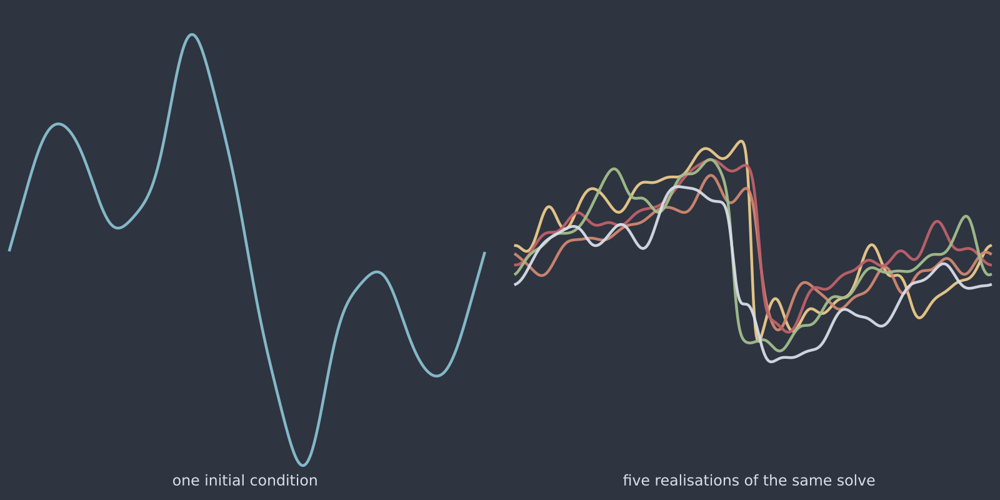

# Stochastic Burgers 1D (`stochastic_burgers_1d`)

Noise on top of nonlinear dynamics, which is where uncertainty stops being
tractable analytically. Burgers concentrates its structure into thin fronts,
and the noise perturbs *where those fronts sit*, so the ensemble spread is not
a smooth field: it is a set of narrow, tall ridges at the front locations.
A predicted uncertainty that is smooth in space will be wrong in exactly the
places that matter.

<figure class="pf-model-fig" markdown>

<figcaption>One initial condition and five realisations of the same solve (<code>stochastic_burgers_1d</code>): the members agree away from the fronts and disagree at them.</figcaption>
</figure>

## Equation

$$du = \left[-u\,\frac{\partial u}{\partial x}
+ \nu\,\frac{\partial^2 u}{\partial x^2}\right] dt
+ \sigma\,dW(t, x)$$

with additive space-time noise, white in time and optionally smoothed in space,
on the periodic domain.

## Operator learning task

$$u_0 \mapsto \{u_T^{(1)}, u_T^{(2)}, \dots\}$$

the natural target for distributional operator learning of
$P(u_T \mid u_0)$.

## Parameters

| Parameter | Default | Range | Description |
|-----------|---------|-------|-------------|
| `viscosity` | 0.05 | (1e-4, 1.0) | Viscosity $\nu$ |
| `noise_intensity` | 0.1 | (0.0, 2.0) | Noise amplitude $\sigma$ |
| `n_realizations` | 10 | (1, 1000) | Realisations per initial condition |
| `time_horizon` | 0.5 | (0.01, 10.0) | Final time $T$ |

## Usage

```python
from pdeforge import generate_dataset

dataset = generate_dataset(
    model="stochastic_burgers_1d",
    n_samples=200,
    resolution={"x": 256},
    params={"viscosity": 0.05, "noise_intensity": 0.1, "n_realizations": 20},
    seed=42,
)
dataset.outputs.shape   # (200, 20, 256)
```

## Solver

Exponential integrator for the exact viscous part, explicit dealiased
advection, and Euler-Maruyama noise increments: the same conventions as the
stochastic heat models. Sending $\sigma \to 0$ recovers the deterministic
dynamics, which the test suite checks.

## Behaviour

The interaction between noise and nonlinearity is the whole point. Because
front position depends on the whole history of the field, a small perturbation
early produces a displaced front later, and displacing a steep front produces a
large pointwise difference. The result is that ensemble variance is
concentrated where the deterministic solution has its steepest gradients, and
the distribution there is skewed rather than Gaussian.

Raising `viscosity` widens the fronts and makes the spread better behaved;
lowering it sharpens both the fronts and the failure of any Gaussian
approximation.

## Data shapes

```python
dataset.inputs.shape   # (n_samples, nx)
dataset.outputs.shape  # (n_samples, n_realizations, nx)
```

## Related

- [`burgers_1d`](burgers_1d.md): the deterministic model.
- [`stochastic_heat_1d`](stochastic_heat_1d.md): the linear case, where the
  conditional law stays Gaussian.
- The [calibration protocol](../guide/calibration.md) and the
  [stochastic systems guide](../advanced/stochastic.md).
