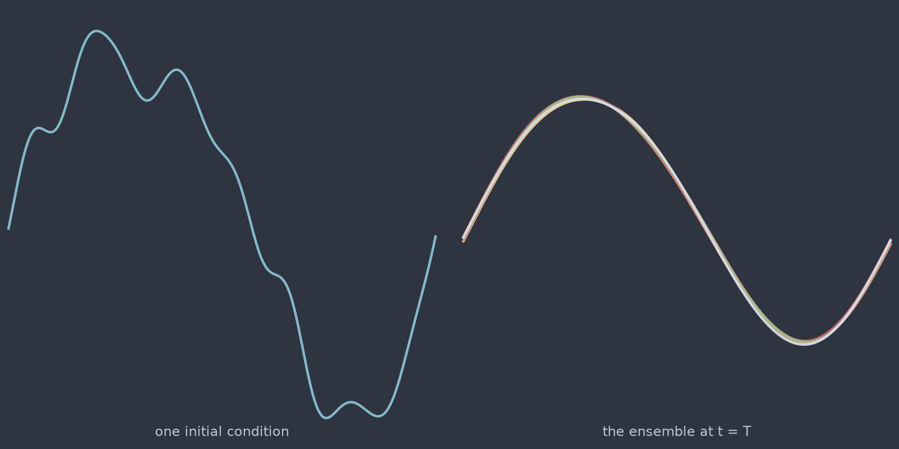

# Stochastic heat 1D (`stochastic_heat_1d`)

The point at which the operator stops being a function. Add space-time noise to
the heat equation and one initial condition no longer has one answer: it has a
distribution. Every sample therefore carries **several realisations** of the
same solve, which is the shape a distributional learning target actually needs
and the reason PDEForge treats uncertainty as a property of the data rather
than a post-processing step.

<figure class="pf-model-fig" markdown>

<figcaption>One initial condition and five members of its ensemble at t = T (<code>stochastic_heat_1d</code>): the spread is the quantity being learned.</figcaption>
</figure>

## Equation

$$\frac{\partial u}{\partial t}
= \alpha\,\frac{\partial^2 u}{\partial x^2} + \sigma\,\dot{W}$$

where $\dot{W}$ is space-time noise, expanded in Fourier modes as
$\dot{W}(x, t) = \sum_k \eta_k(t)\,e_k(x)$ with independent Brownian motions
$\eta_k$. Periodic boundary conditions.

## Operator learning tasks

Two, and which one you want decides how you consume the output:

1. **Realisations.** $u_0 \mapsto \{u_T^{(1)}, u_T^{(2)}, \dots\}$, learning
   the conditional distribution directly.
2. **Moments.** $u_0 \mapsto (\mathbb{E}[u_T],\ \operatorname{Var}[u_T])$,
   learning the first two moments.

## Parameters

| Parameter | Default | Range | Description |
|-----------|---------|-------|-------------|
| `diffusivity` | 0.01 | (1e-6, 1.0) | Thermal diffusivity $\alpha$ |
| `noise_intensity` | 0.1 | (0.0, 1.0) | Noise amplitude $\sigma$ |
| `n_realizations` | 20 | (1, 200) | Realisations per initial condition |
| `time_end` | 1.0 | (0.01, 10.0) | Final time; longer accumulates more noise |

`n_realizations` sets the quality of any moment estimate you take from the
data: the standard error of the sample mean falls as $1/\sqrt{n}$, so 20
realisations give roughly 22% relative error on a per-point variance estimate
and 200 give about 7%.

## Usage

```python
from pdeforge import generate_dataset

dataset = generate_dataset(
    model="stochastic_heat_1d",
    n_samples=100,
    resolution={"x": 256},
    params={"diffusivity": 0.01, "noise_intensity": 0.1, "n_realizations": 50},
    seed=42,
)
dataset.outputs.shape   # (100, 50, 256): 50 realisations per initial condition
```

## Solver

Exponential integrator for the exact viscous part with Euler-Maruyama
increments for the noise. Setting $\sigma = 0$ recovers [`heat_1d`](heat_1d.md)
exactly, which is how the stochastic path is validated.

## Behaviour

Diffusion and noise pull in opposite directions. Diffusion damps high
wavenumbers; the noise injects them at every step. The stationary balance puts
variance at mode $k$ proportional to $\sigma^2 / (2\alpha k^2)$, so the
ensemble spread is dominated by long wavelengths while the fine structure stays
close to the deterministic solution. An operator that predicts the mean well
can still be badly wrong about the spread, which is the failure the calibration
split exists to catch.

## Data shapes

```python
dataset.inputs.shape   # (n_samples, nx)
dataset.outputs.shape  # (n_samples, n_realizations, nx)
```

## Related

- [`heat_1d`](heat_1d.md): the deterministic limit at $\sigma = 0$.
- [`stochastic_heat_2d`](stochastic_heat_2d.md): the same model on the square.
- [`stochastic_burgers_1d`](stochastic_burgers_1d.md): noise on top of
  nonlinear dynamics, where the spread is no longer Gaussian.
- The [calibration protocol](../guide/calibration.md), which is what these
  ensembles are generated for.
