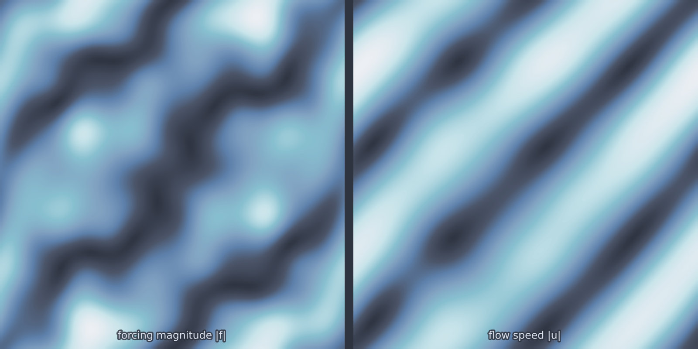

# Stokes 2D (`stokes_2d`)

Creeping flow, where inertia is absent and the response to a force is
instantaneous and linear. That makes Stokes the natural first flow problem:
the operator to be learned is genuinely a linear map, so any error is
attributable to the representation rather than to nonlinearity. The
incompressibility constraint is what gives it teeth, since it couples every
point to every other.

<figure class="pf-model-fig" markdown>

<figcaption>Forcing magnitude and the flow speed it drives (<code>stokes_2d</code>): the divergence-free constraint redistributes the response away from the forcing.</figcaption>
</figure>

## Equation

$$-\mu\,\nabla^2 \mathbf{u} + \nabla p = \mathbf{f},
\qquad \nabla \cdot \mathbf{u} = 0$$

on the periodic domain, with $\mathbf{u} = (u, v)$ the velocity, $p$ the
pressure and $\mathbf{f} = (f_x, f_y)$ a body force.

## Operator learning task

$$(f_x, f_y) \mapsto (u, v, p)$$

## Parameters

| Parameter | Default | Range | Description |
|-----------|---------|-------|-------------|
| `viscosity` | 1.0 | (0.01, 100.0) | Dynamic viscosity $\mu$; higher gives smoother velocity |
| `force_complexity` | 5 | (1, 20) | Fourier modes in the random forcing |

`force_complexity` is the difficulty control, since it sets how multi-scale
the input measure is. At 1 the forcing is a single mode and the answer is a
single mode; at 20 the forcing spans a wide band and the viscous response
weights those bands very unevenly.

## Usage

```python
from pdeforge import generate_dataset

dataset = generate_dataset(
    model="stokes_2d",
    n_samples=1000,
    resolution={"x": 64, "y": 64},
    params={"viscosity": 1.0, "force_complexity": 5},
    seed=42,
)
```

## Solver

Spectral, with the divergence-free constraint enforced exactly by Leray
projection: the forcing is projected onto its solenoidal part in Fourier
space, and what is removed is precisely the pressure gradient. No iteration
and no saddle-point system, and the constraint holds to machine precision
rather than to a tolerance.

!!! note "This is the spectral Stokes"
    Despite sitting alongside the flow models that need FEniCSx, this one runs
    on the base installation. The domain is periodic, which is what makes the
    spectral solve possible.

## Behaviour

Response amplitude scales as $1/(\mu |\mathbf{k}|^2)$, so long-wavelength
forcing produces far larger flow than short-wavelength forcing of the same
amplitude. A dataset drawn from a broadband forcing measure therefore has
outputs dominated by its lowest modes, and an operator can score well while
ignoring most of the input spectrum. Reporting error band by band is more
informative here than a single aggregate.

## Data shapes

```python
dataset.inputs.shape   # (n_samples, ny, nx, 2)   fx, fy
dataset.outputs.shape  # (n_samples, ny, nx, 3)   u, v, p
```

The component axis is **trailing** here. Several of the spectral multi-field
models stack components on a leading axis instead, so check the shape rather
than assuming a convention across the catalogue.

## Related

- [`cylinder_flow_2d`](cylinder_flow_2d.md): viscous flow with walls and
  inertia, solved by finite elements.
- [`ns_vorticity_2d`](ns_vorticity_2d.md): the same incompressibility with the
  nonlinear term restored.
- [`darcy_2d`](darcy_2d.md): the other steady spectral problem.
